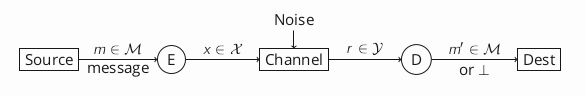
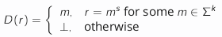
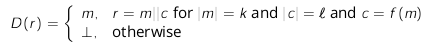

# Introduction to Coding Theory

## Terminology

* **alphabet** $\Sigma$ - finite set with at least two elements, e.g. $\mathbb{B} = \{0,1\}$
* **message space** $\Mu=\Sigma^k$: set, with $k$ the message length
* **source**: something that outputs a message $m \in \Mu$
* **destination**: something that can input a message $m \in \Mu$
* **channel**: has an associated input space $X$ and output space $Y$ - when you send an $x \in X$ to the channel, it outputs a value $r \in Y$
* **encoding**: function $E : \Mu \to X$ that takes a message $m$ you want to encode and returns an $x \in X$ that the channel can handle (*injective*)
* **decoding**: function '$D : Y \to \Mu$' that takes a $r \in Y$ as input and outputs a message $m \in \Mu$ or a special symbol $\bot \in \Mu$, which indicates that the decoding failed
* **code**: subset of $X$, the image of the encoding function

---

## Repetition Code

* $m^s$ means message $m$ repeated $s$ times

> #### S-times repetition code for message space $M = \Sigma^k$:
> * code applies to a channel w/ $X = Y = \Sigma^{s \times k}$
> * **encoding**: repeat $m$ exactly $s$ times; $E(m) = m^s$
> * **decoding**: for $r \in \Sigma^{s \times k}$, check if it is the $s$-times repetition of some message $m \in \Sigma^k$:
>   * 

* detects: $s-1$ errors

e.g. for any $s \geq 2$, this code will detect at least a **single** error

* corrects: *no* errors

---

## Checksums

> #### Checksum Code for $f: \Sigma^k \to \Sigma^l$:
> * This code applies when $X=Y=\Sigma^{k+l}$
> * $E(m) = m || f(m)$, where $||$ means concatenation
> * Decoding:
>   * 

> #### Linear Checksum Code
> For $\Sigma = \Z_p$ and $\Mu = \Sigma^k$, the linear checksum code defined by vector $\bar{a} \in \Sigma^k$ is the checksum code with:
> $$f(\bar{m}) = \langle \bar{a},\bar{m} \rangle = \Sigma^k_{i=1} a_i \times m_i$$
> * it detects any **one** error if none of the $a_i$ is zero, or a zero-divisor
> * if $n$ is prime (field), $a_i =\not 0$ for all $i$ and $a_i =\not a_{i+1}$ for all $i < k$ and $a_k =\not 1$, then it also detects all **transpositions** of two adjacent symbols

---

## Examples