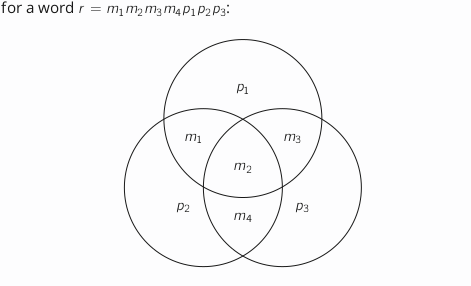

# Linear Codes

> Let:
> * $\mathbb{F}$ be a field
> * $\Mu=\mathbb{F}^k$
> * $X=\mathbb{F}^n$
> * $C \subseteq X$ be a blockcode
> 
> The code is called linear if:
> * $C$ is a subspace of $X$
> * the encoding function $E : \Mu \to X$ is linear
> 
> $C$ is an $[n,k]_q$ code if $C$ is a linear code 
> * messages are *vectors* of length $n$, and the field itself has $q$ elements
> 
> If we know that $C$ has min. dist. $d$, we can call it a $[n,k,d]_q$ code

---

## Generator Matrices

> #### Generator Matrix:
> A generator matrix $G$ for a linear code $C$ as above is a $k \times n$ matrix, s.t. the encoding function is $E(m) = m \times G$
> 
> (where $m$ is represented as a $1 \times k$ row vector)

### Example

This is the 2-times repetition code:
$$
G_{rep}=
\begin{pmatrix}
    1 & 0 & 0 & 1 & 0 & 0 \\
    0 & 1 & 0 & 0 & 1 & 0 \\
    0 & 0 & 1 & 0 & 0 & 1
\end{pmatrix}
$$

### Systematic Encoding

A code that turns $k$-symbol messages into $n$-symbol codewords (where $k \leq n$) s.t. a codeword is the message itself followed by $n-k$ further symbols is called a **systematic encoding**.

> #### Systematic Encoding:
> $k \times n$ generator matrix (where $k \leq n$) that has:
> * a $k \times k$ identity matrix
> * $n-k$ further columns

#### Example

This is the $1$-symbol checksum code on messages of length $3$:
$$
G_{sum}=
\begin{pmatrix}
    1 & 0 & 0 & 1 \\
    0 & 1 & 0 & 1 \\
    0 & 0 & 1 & 1
\end{pmatrix}
$$

You can turn any linear code into a systematic one with the same parameters:

> If $C$ is a linear code with generator matrix $G$, then there is a systematic encoding $G'$ of the same dimensions as $G$ that produce the same code $C$.
> 
> You can create $G'$ from $G$ from a combination of the following linear operations:
> * **multiply** a row or columns w/ a non-zero field element
> * **add** a multiple of one row to another
> * **permuting** rows or columns
> Basically; guassian but slightly different

---

## Parity-check Matrices

To tell if a vector $x \in X$ is in $C$, we can project a received word $r$ onto the orthogonal space $C^\bot$ of the code - if we get the zero vector, we know $r \in C$

> #### Party-check Matrix:
> A party-check matrix $H$ for a linear code $C \subseteq X$ is a matrix s.t. $c \in C \equiv Hc^T = 0$
> 
> If $C$ has dimension $k$ and $X$ has dimension $n$, then there exists a parity-check matrix $H$ of dimension $(n-k) \times n$

For a systematic encoding, if we write the generator matrix as $G=(\mathbb{I}_k|P)$ then one parity-check matrix is:
$$H=(-P^T|\mathbb{n-k})$$
which is the **negative** of the transpose parity matrix followed by an **identity** matrix of size $n-k$

---

## Distance of a Linear Code

The **minimum distance** of a linear code is equal to both of the following:
* the **lowest Hamming weight** of any non-zero codeword
* the minimal number of columns in the parity-check matrix needed to get a set of **linearly dependent** columns

---

## (7,4) Hamming Code

(7,4) code that Hamming invented encodes $4$ bits of data as a $7$-bit codeword - it is a code with $\Sigma=\mathbb{F}_2, k=4, n=$

It is a linear code with the following three parity bits:
$$
\begin{matrix}
    p_1 = & m_1 &+ & m_2 &+& m_3\\
    p_2 = & m_1 &+ & m_2 &+& && m_4\\
    p_2 = && & m_2 &+& m_3 &+& m_4
\end{matrix}
$$

$$
G=
\begin{pmatrix}
    1 & 0 & 0 & 0 & 1 & 1 & 0 \\
    0 & 1 & 0 & 0 & 1 & 1 & 1 \\
    0 & 0 & 1 & 0 & 1 & 0 & 1 \\
    0 & 0 & 0 & 1 & 0 & 1 & 1
\end{pmatrix}
$$

All non-zero codewords have a weight of at least $d=3$; this gives us single error **correction** or double error **detection** depending on whether we use *strict* or *maximum-likelihood* decoding.

The number of bits set in each circle must be **even** - if so, you have a codeword.

If not - (assuming a single error) the error is in the area that represents the **intersection** of all the incorrect circles and none of the correct ones.

### Example
$r=0100010$

The top circle has only $1$ bit set - something must have gone **wrong**.

The left circle has $2$ bits set - **OK**

The right circle has $1$ bit set - **wrong**.

$\therefore$ the mistake must be the intersection of the top and right circles, but not the left one; $m_3$

$\Rightarrow$ the sent codeword must have been $c=0110010$, which we can decode as $m=0110$