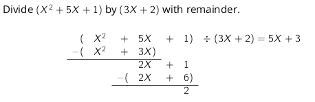
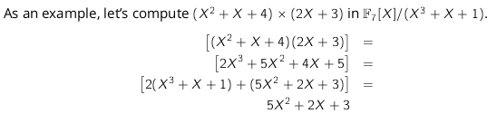

# Polynomials

## Degree

The degree of a non-zero polynomial is the index of the highest coefficient which is non-zero, starting the count at $0$.

> For poly `p,q`:
> 
> `deg(p + q)`$\leq$ `max(deg(p), deg(q))`
> 
> `deg(p`$\times$`q) `$\leq$ `deg(p) + deg(q)`

## Arithmetic

$\Rightarrow (x^2 + 5x + 1) = (5x + 3) \times (3x + 2) + 2$

## Fields

> #### Field Modulo Polynomial
> 
> For a field $\mathbb{F}$, we mean by $\mathbb{F}[x]/p(x)$ the ring of equivalence classes of polynomials under ~$_p$, where the representative of each class is the **unique polynomial** in that class of degree $<$ `deg(p)`
> > ~$_p$:
> > 
> > Two polynomials $a, b$ are equivalent if there is a polynomial s.t. $a + p \times q = b$; you can add a multiple of $p$ to $a$ to get $b$

