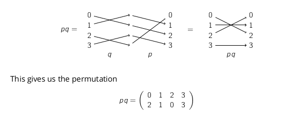

# Subgroups

$\mathbb{H}=(H,+)$ is subgroup of $\mathbb{G}=(G,+)$ if $G \subset H$ and $\mathbb{H}$ is a group for the same operation $+$.

These rules must be followed:

1. the neutral element $e$ is in $H$
2. for any elements $a$,$b$, their sum $a + b$ is also in $H$
3. for any element $a$, its inverse $-a$ is also in $H$

## Trivial Subgroups

There are two trivial subgroups for any group:

1. $(G, +)$ itself
2. $({e}, +)$, where $e$ is the neutral element

## Generators

The subgroup generated by $g$, an element of $G$, is written $<g>$, and is the group containing the following elements:

* $g$ is an element of $<g>$
* the neutral element $e$
* if $a, b$ are elements of $<g>$, so is $a + b$
* if $a$ is an element of $<g>$, so is $(-a)$

> elements $g$ of $G$ in a group $(G, +)$ with $<g>$ = $G$ are called **generators**
> 
>  If a group has a generator, it is called a **cyclic** group

The definition of generating a subgroup by one element generalises to several elements.

## Order

The order of an element $g$ in a group $\mathbb{G} = (G, +)$ is the order of the subgroup $<g>$.

> ### Lagrange's Theorem
> 
> If $\mathbb{G} = (G, +)$ is a finite group, then the order of any subgroup of $\mathbb{G}$ divides the order of $\mathbb{G}$

The order of all elements in ($\mathbb{Z}_p$, $+_p$) is $p$, apart from $0$ (which is $1$). This is because the order of a subgroup must divide the order of the group; the order must be $1$ or $p$.

## Permutations

For $n \in \mathbb{N}$, the symmetric group $S_n$ is the group whose elements are the permutations of the set ${0, 1, ..., n-1}$, and the group operation is composition.

For any positive integers $m \leq n$, the group $S_m$ is a subgroup of $S_n$.

## Cycles

Any permutation can be written as a composition of a cycle with **disjoint** elements.

1. if you rotate the elements in a cycle by taking the last element and placing it as the first new element, you get the same permutation
2. if $c$ and $d$ are two disjoint cycles, then $cd = dc$
3. if two cycles $c,d$ share exactly one element $x$, their composition is the cycle obtained by rotating $x$ to be in the last place of $c$ and the first place of $d$