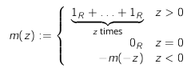

# Homomorphisms

## Group Homomorphism

$f: G \rightarrow H$ is a group homomorphism from $(G, +_G)$ to $(H, +_H)$ if it preserves:
* **neutral elements**: $f(0_G) = 0_H$
* **addition**: $f(a +_G b) = a +_H b$
* **inverses**: $f(-a)$ is the inverse of $f(a)$

e.g. $(\mathbb{Z}, +)$ to $(\mathbb{Z}_n, +_n)$

---

## Group Isomorphisms

A homomorphism is a **isomorphism** if there also exists another homomorphism from the new group to the original.

> For any prime number $p$, there is only one group of order $p$ up to isomorphism
> $\therefore$ if we have any two groups of order $p$ where $p$ is a prime then they are automatically isomorphic

e.g. $f: (\langle 2\rangle, \cdot) \rightarrow (\mathbb{Z}_3, +)$ and $g$ back:

|$f$|$g$|
|-|-|
|$f(1)=0$|$g(0)=1$|
|$f(2)=1$|$g(1)=2$|
|$f(4)=2$|$g(2)=4$|

---

## Cartesian Products

$$\mathbb{G} \times \mathbb{H} = (g,h), \forall \ g \in G \ \& \ h \in H$$

where the sum of $(g,h)$ and $(g',h')$ is $(g +_G g', h +_H h')$

Every finite Abelian group $\mathbb{G}$ is isomorphic to exactly one group of the form $\mathbb{Z}_{p1^{m_1}} \times ... \times \mathbb{Z}_{pk^{m_k}}$, where the $p_i$ are primes and the $m_i$ positive integers

e.g. $(\mathbb{Z}_15, +)$ is isomorphic to $\mathbb{Z}_3 \times \mathbb{Z}_5$

---

## Automorphisms

An isomorphism from a group (or ring, field) $\mathbb{G}$ to itself is called an automorphism of $\mathbb{G}$

The automorphisms of any object ${G}$ form a group called Aut($mathbb{G}$), with composition as the operation.

---

## Ring Homomorphisms

$f: R \rightarrow S$ is a ring homomorphism if $f$ is a group homomorphism from $(R, +)$ to $(S, \oplus)$ and:
* for any $a,b \in R$ we have $f(a \cdot b) = f(a) \odot f(b)$
* $f(1_R) = 1_S$

> For any ring $R$, there is exactly one ring homomorphism from $\mathbb{Z} \rightarrow R$ and it is the map:
> 
> 

The characteristic of a ring $R$ is the **smallest positive integer $z$** for which $m(z) = 0$, the zero of the ring. If no such intger exists, the characteristic is $0$.

e.g. `char(`$\mathbb{Z}$`) = 0` and `char(`$\mathbb{Z_n}$` = n`