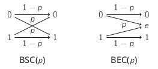
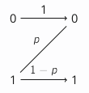

# Channel Coding

## Discrete Memoryless Channels

> #### Channel
> A **channel** has:
> * **input alphabet** $X$
> * **output alphabet** $Y$

This is represented by a conditional probability function $p_{Y\vert X}$ - if you send $x\in X$ to the channel, the probability it outputs $y\in Y$ is $p_{Y\vert X}(y, x)$.

In a noiseless channel, $X=Y$ and $p_{Y\vert X}(y,x)$ is equal to $1$ if $y=x$, else $p_{Y\vert X}$ is 0.

---

## Shannon's $2^{nd}$ Theorem

> #### Channel Capacity
> The capacity of a discrete memoryless channel with distribution $p_{Y\vert X}$ is the quantity:
> $$C= max_X I(X,Y)$$

Shannon's second theorem says that however well we encode, we cannot get information across a channel at a higher rate than the channel capacity.s

---

## Binary Symmetric and Esaure Channels

> #### Binary Symmetric Channel (BSC)
> The $BSC(p)$ for $p\in [0,1]$ is a channel with $X=\{0,1\},Y=\{0,1\}$ and the following behaviour on input $x$:
> * outputs $x$ with probability $(1-p)$
> * ouputs $1-x$ with probability $p$

> #### Binary Erasure Channel (BEC)
> The $BSC(p)$ for $p\in [0,1]$ is a channel with $X=\{0,1\},Y=\{0,1,e\}$ and the following behaviour on input $x$:
> * outputs $x$ with probability $(1-p)$
> * ouputs $e$ with probability $p$

### Capacity

Let's compute the capacity of the $BSC(p)$ channel.

Since $I(X,Y)=H(Y)-H(Y\vert X)$ we want to maximise this quantity over all possible input distributions $X$.

$$h_2(z)=-z\log_2(z)-(1-z)\log_2(1-z)$$

* $H(Y\vert X) = (1-q) \times H(Y\vert X=0) + q \times H(Y\vert X=1)$
* $H(Y\vert X=0) = -p_{Y\vert X}(0,0)\log_2(p_{Y\vert X}(0,0))-p_{y\vert X}(1,0)\log_2(p_{Y\vert X}(1,0)) = -p \log_2(p)-(1-p)\log_2 (1-p) = h_2(p)$
* For the same reason, $H(Y\vert X=1) = h_2(p)$
* $\therefore H(Y\vert X) = (q+(1-q)) \times h_2(p) = h_2(p)$

The entropy of $Y$ conditioned on a particular input $x$ depends only on the channel properties.

If we want to maximise $H(Y) - H(Y\vert X)$ over all input distributions $X$, we have just computed that $H(Y\vert X)$ does not depend on $X$ at all, but only on $p$ - it remains only to maximise $H(Y)$.

> #### Capacity of $BSC(p)$
> $$C_{BSC(p)}=1-h_2(p)$$

Intuitively, the makes sense: for $p=0$ or $p=1$ the capacity is one bit (you send one bit and can always tell from the received bit what you sent), wheras for $p=\frac{1}{2}$ the output is independent of the input; you never transmit any information at all.

---

## The Z Channel

The Z channel is an example of an **asymmetric** channel:

### Capacity

Let's compute the capacity of the Z channel.

As before, let:
* $X$: channel input
* $Y$: channel output
* $q=p_x(0)$

We want a formula for $I(X,Y) = H(Y)-H(Y\vert X)$
We define:
$$L(a) = a\times log_2(a)$$
With $L(0) := 0$ and $h_2(a) = -L(a)-L(1-a)$

Since $p_Y(1)=(1-q)(1-p)$ we have $H(Y)=h_2((1-q)(1-p))$. For the conditional entropy term, we expand:

$$H(Y\vert X)=(1-q)\times H(Y\vert X=1) + q\times H(Y\vert X=0)$$
$$=(1-q)\times (L(p_{Y\vert X}(0,1)) + L(p_{Y\vert X}(1,1)))$$
$$+ q \times (L(p_{Y\vert X}(0,0)) + L(p_{Y\vert X}(1,0)))$$

We are left with $H(Y\vert X)=(1-q)\times h_2(p)$.

*Some other analysis that probably won't be in the exam.*