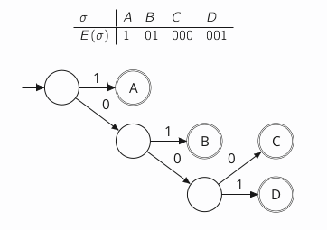

# Introduction to Information Theory

## Encoding Words

We want an encoding scheme $(E,D)$ with $E: \Sigma \to X^+$ and $D: X^+ \to \Sigma$ to encode and decode, with the property that for all $m \in \Sigma$ we have $D(E(m))=m$.

This means we want $E$ to be **injective** and $D$ to be **surjective**.

> #### Prefix-free
> An encoding $E: \Sigma \to X^+$ is prefix free if there are no two *distinct* codewords $c,c'$ in the image of $E$ s.t. one is a **prefix** of the other

This makes an encoding **instantaneous** - once you've recieved a $1$ for eample, you know immediately that a character is complete and you can pass it on to the next part of your application to be processed.

## Decoding Trees

> A code is **prefix-free** iff all the accepting states in the decoding tree are leaves.

---

## Constructing Efficient Codes

> #### Kraft Inequality
> For any uniquely decodable code $C \subseteq X^+$ over an alphabet $X$, we have:
> $$\sum_{w \in C} |X|^{-|w|} \leq 1$$

For example, $|X|=2$, $X={0,1}$.

We're assigning each codeword a weight that gets exponentially smaller as the codewords get longer - a word of length $1$ has weight $\frac{1}{2}$; a word of length $2$ has weight $\frac{1}{4}$ and so on.

The Kraft Inequality says that the total weight of all the words in the code is at most $1$.