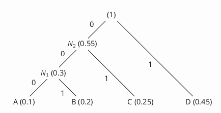

# Source Coding

Finding the most efficient code for a particular probability distribution is known as the **source coding** problem.

## Huffman Coding

### Algorithm

1. Take the two elements in the distribution with the lowest probabilities (if there are more than two, pick any such two)
2. Create a new node in the tree that has the two chosen nodes as children
3. Delete the two chosen elements from the probability distribution and replace them by a new element representing the new node, whose probability is the sum of the two elements that you removed

### Example

|$x$|A|B|C|D|
|-|-|-|-|-|
|$p(x)$|0.1|0.2|0.25|0.45|

This gives:

|$x$|A|B|C|D|
|-|-|-|-|-|
|$E(x)$|000|001|01|1|

The expected length (bits) of this code is:
$$L=0.3\times3+0.25\times2+0.45\times1=1.85$$