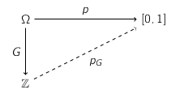

# Probability II

## Random Variables

> #### Random Variable
> A random variable on a probability space $(\Omega, p)$ is a function $X: \Omega \to S$ from $\Omega$ to some set $S$
> 
> A random variable X creates a probability function $p_X$ on S defined as:
> $$p_X(x) = P(\{\omega \in \Omega | X(\omega) = x\}) $$
> i.e. the probability of getting a particular $x \in S$ is the probability of the event that you pick an $\omega$ that, when you apply $X$ to $\omega$, you get $x$

> #### Expected Value
> The expected value of a random variable $X$ is:
> $$E[X] := \sum_{w\in\Omega} X(\omega) \times p(\omega) = \sum_{s\in S} s \times p_x(s)$$

## Conditional Notation

#### Marginal Probability Distribution
$p_X(x)$ is the probability $P(X = x)$ of the event that random variable $X$ takes value $x$
#### Joint Probability Distribution:
$p_{XY}(x,y) = P(X=x \And Y=y)$
#### Conditional Probability Distribution:
$P_{X|Y}(x,y) = P(X=x|Y=y)$

## Independence

Two random variables $X,Y$ are independent if for all $x \in X$ and $y \in Y$:
$$P(X=x \And Y=y) = P(X=x) \times P(Y=y)$$