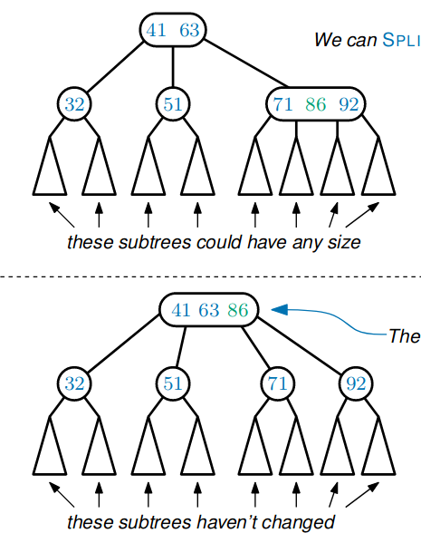

# Dynamic Search Structure

A dynamic search structure stores a **set of elements**.

Each element $x$ must have a *unique* key $x.key$.

Supported operations:
* $INSERT(x,k)$ - inserts $x$ with key $k$
* $FIND(k)$ - returns the *(unique)* element $x$ with $x.key = k$
* $DELETE(k)$ - deletes the *(unique)* element $x$ with $x.key = k
> Also support for:
> * $PREDECESSOR(k)$ - returns the *(unique)* element $x$ with the largest key s.t. $x.key < k$
> * $RANGEFIND(k)$ - returns every element $x$ with $k_1 \leq x.key \leq k_2$

---

## Linked List

* $INSERT$ is very efficient - add the new item to head of the list in $O(n)$ time
* $FIND$ and $DELETE$ are very inefficient - they take $O(n)$ time

---

## Binary Search Trees

$FIND, INSERT, DELETE$ all take $O(h)$ time, where $h$ is the height.

$h$ could be either as small as $\log_2n$ or as **big** as $n$.

Each $INSERT$ could increase $h$ by one!

---

## 2-3-4 Trees

* Nodes can have between $2$ and $4$ children.
* **Perfect balance** - every path from the root to a leaf has the *same length*.

The keys held at a node determine the contents of its subtrees.

||2-node|3-node|4-node|
|-|-|-|-|
|children|2|3|4|
|keys|1|2|3|

---

### $FIND(k)$

We perform a $FIND$ operation by following a path from the root - decisions are made by **inspecting the key(s)** at the current node and following the appropriate edge.

$$O(h)$$

#### The Height

The perfect balance imples that the height, $h$, of a 2-3-4 tree with $n$ nodes is:

Best case: (all $4$-nodes)
$$\log_4n = \dfrac{\log_2n}{2}$$

Worst case: (all $2$-nodes)
$$\log_2n$$

> $h$ is between $10$ and $20$ for a million nodes

$\therefore$ The time complexity of $FIND$ is:
$$O(h) = O(\log n)$$

---

### $INSERT(x,k)$

1. Search for the key $k$ as if performing $FIND(k)$
   
   * $SPLIT$ $4$-nodes as we go down
2. If the leaf is a $2$-node, insert $(x,k)$, converting it into a $3$-node
3. If the leaf is a $3$-node, insert $(x,k)$, converting it into a $4$-node

#### SPLITTING $4$-nodes

We can $SPLIT$ any $4$-node into two $2$-nodes if its parent isn't a $4$-node.

> The extra key is pushed up to the parent.

This takes $O(1)$ time.

> What if we $SPLIT$ the root?
> This **increases** the height of the tree, and increases the length of all root-leaf paths by one
> 
> $\therefore$ is maintains the perfect balance property

$SPLIT$ has time-complexity:
$$O(\log n)$$

---

### $DELETE(k)$

On a **leaf**:
1. Search for the key $k$ using $FIND(k)$
   * Use $FUSE$ and $TRANSFER$ to convert $2$-nodes as we go down
2. If the leaf is a $3$-node, delete $(x,k)$, converting it into a $2$-node
3. If the leaf is a $4$-node, delete $(x,k)$, converting it into a $3$-node

#### $FUSING$ $2$-nodes

We can $FUSE$ two $2$-nodes (with the *same parent*) into a $4$-node, if the parent isn't a $2$-node.

The extra key is pulled down from the parent (doesn't work if the parent is a $2$-node).

No path lengths have changed.

$O(1)$

> ##### $FUSING$ the **root**
> We make an exception for the root:
> 
> 
> This can **decrease** the height of the tree, decreasing the length of all root-leaf paths by one; it maintains the perfect balance property.

#### $TRANSFERRING$ keys

If there is a $2$-node and a $3$-node *(with the same parent)*, we can perform a $TRANSFER$.

The keys get rearranged; no path lengths have changed.

$O(1)$

Time complexity of $DELETE$:
$$O(\log n)$$

On something which **isn't** a root:
1. Find the $PREDECESSOR$ of $k$ (basically $FIND$)
   
   (the element with the largest key $k'$ s.t. $k' < k$)
2. Call $DELETE(k')$

   Fortunately $k'$ is always a leaf
3. Overwrite $k$ with another copy of $k'$

This also takes:
$$O(\log n)$$

---

### Summary

It turns out $2-3-4$ trees are awkward to implement - we use **Red-Black** trees in practice.

#### Red-Black Trees

A Red-Black tree is a data structure based on a **binary** tree strcutre.

Each operation takes worst case $O(\log n)$ time.

* The root is **black**
* All root-to-leaf paths have the same number of **black** nodes
* Red nodes cannot have red children

Any 2-3-4 tree can be converted into a Red-Black tree (and vice-versa)

---

### Proper Summary:

||INSERT|DELETE|FIND|
|-|-|-|-|
|Unsorted Linked List|$O(1)$|$O(n)$|$O(n)$|
| Binary Search Tree|$O(n)$|$O(n)$|$O(n)$|
| $2-3-4$ Tree|$O(\log n)$|$O(\log n)$|$O(\log n)$|
| Red-Black Tree|$O(\log n)$|$O(\log n)$|$O(\log n)$|

---

## Skip Lists

Sorted Linked List:
* $FIND$ is very inefficient $O(n)$
* $INSERT$ and $DEELETE$ also take $O(n)$, but only because they rely on $FIND$

### Making Shortcuts

We've attached a second linked list containing only some of the keys.

$FIND(k)$:
1. Start in the top list
   
   Go right until we come to a key $k' > k$
2. Move down to the bottom list
   
   Go right until we find $k$

The **time-complexity** depends on where we place the shortcuts.

### Linked Lists with Many Levels

If we spread out the $m$ keys in the top list evenly, the worst-case time for a $FIND$ operation becomes $O(\frac{m+n}{m})$

By setting $m=\sqrt(n)$, we get the worst-case time for a $FIND$ operation is only $O(\sqrt(n))$

## Linked Lists with Many Levels

Each **level** (list) will now contain half of the keys from the level below. They are chosen to be as evenly spread as possible.

The bottom level contains every key, and every level contains the leftmost and rightmost keys.

As each level contains half of the keys from the level below, there are $O(\log n)$ levels.

$FIND(k)$:
1. Start at the top-left
2. While you haven't found $k$;
    * If the node to the right's key, $k'\leq k$:
      * Move right
    * Else:
      * Move down
#### Time complexity:
1. We only **move down** at most $O(\log n)$ times, because there are only $O(\log n)$ levels
2. Between any two nodes on level $i$, there are at most $2$ nodes on level $i+1$ (because we took half the nodes and spread them evenly)
3. We only **move right** at most $2$ times on any level $i+1$, because we stopped moving right on level $i$

$\therefore$ we only move at most $O(\log n)$ times while performing a $FIND$

### Building Multi-level Linked Lists by Flipping Coins

Flip one coin for each key:
* for each key that got a head, put it in the new top level
* repeat with the keys from the new top level
  * stop when the top level contains only the smallest and largest keys

The intuition is that $n$ coin flips contains about $\frac{n}{2}$ heads and about $\frac{n}{2}$ tails - the heads are roughly evenly spread out.

---

### Skip Lists

A skip list is a mult-level linked list where the $INSERT$s are done by **flipping coins**.

$INSERT(x,k):$
1. Use $FIND(k)$ to insert $(x,k)$ into the bottom level
2. Flip a coin repeatedly:
   * If you get a *heads*, insert $(x,k)$ into the next level up
   * If you get a *tails*, stop

$DELETE(k):$
1. Use $FIND(k)$ to find $(x,k)$
2. Delete $(x,k)$ from all levels
3. Remove any empty levels *(containing only the smallest and largest keys)*

Each of these operations take expected $O(\log n)$ time.

#### Why?

> After $n$ $INSERT$ operations, the probability that a skip list has more than $2\log n$ levels is at most:
> $$\dfrac{1}{n}$$

As the number of levels is $O(\log n)$ (with high probability), we can conclude the number of times we move down is very unlikely to be $O(\log n)$.

We also move right $O(\log n)$ times for a reason which I can't be bothered to write.

The time complexities for the Skip List are **expected**; for the others they are *worst case*.