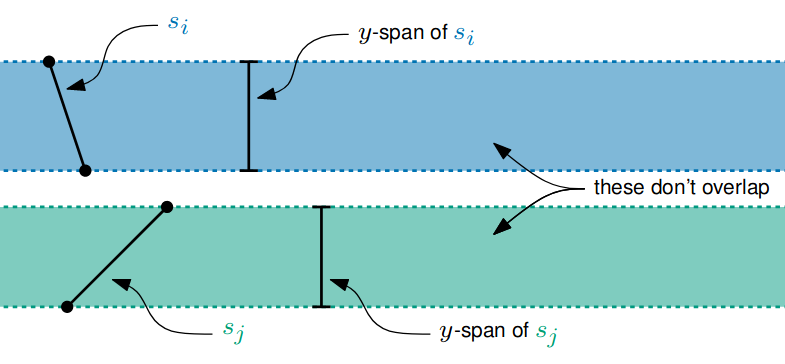
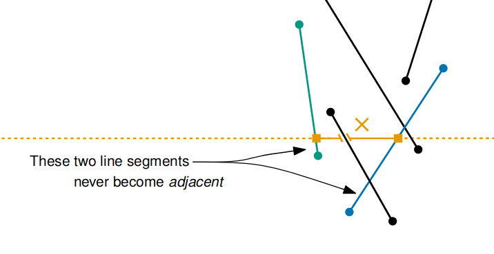
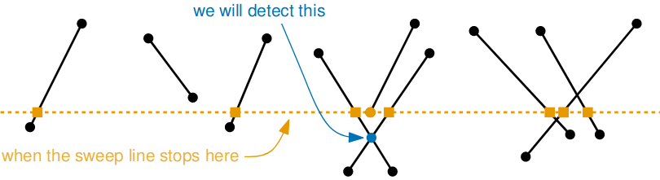
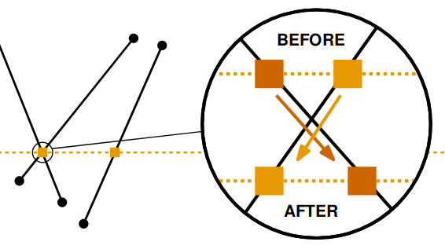

# Line Segment Intersections

Given $n$ line segments, find all the intersections.
* each line segment is given by the coordinates of its end points

## Simple Algorithm

One simple approach is to **test every pair** of line segments.

Let `s_i` denote the `i`$^{th}$ line intersection:
```python
for i in range(1, n):
    for j in range(1, n):
        if s_i intersects s_j and (i != j)
            print(i, j)
```
`intersects` takes $O(1)$ time (any computation on two objects with $O(1)$ space descriptions takes $O(1)$) time

$\therefore$ this algorithm runs in $O(n^2)$ time

In general, there could be more than $(\dfrac{n}{2})^2$ intersections - if we want to output all the intersections, we can't possible expect to do better than $O(n^2)$ time in the worst-case.

The time complexity of the next algorithm will not only depend on the size of the **input**, but the size of the **output** also.

---

Let $k$ denote the number of line segment intersections; we will see an algorithm for line segment intersection which takes:
$$O(n\log n + k\log n)$$
time in the worst-case.

If $k$ is small:
* e.g. $k \leq 2n$, we get $O(n\log n)$ worst-case time

If $k$ is big:
* e.g. $k \geq (\dfrac{n}{2})^2$, we get $O(n^2\log n)$ worst-case time (worse than the simple algorithm)

> We don't allow the input to contain any of the following:
> * horizontal line segments
> * overlapping line segments
> * two end points with the same y-coordinate
> * three (or more) line segments which intersect at the same point

## Observations

### First

If $s_i$ and $s_j$ don't have overlapping $y$**-spans**, they don't intersect:



This suggests we: **sweep** a horizontal line through the plan, from top to bottom, finding intersections as we go.

### Second



Two line segments $s_i$ and $s_j$ which are **never adjacent** don't intersect.

---

## Overall Approach

Imagine a horizontal line passing through the plane from top to bottom (a plane sweep).

We don't process the sweep line at **every** $y$-coordinate; it jumps between interesting positions called **event points**.

The **event points** are the *end points* of line segments and the *intersection points* - we have to detect the *intersection points* on the fly (before we get to them).

> The number of event points is $O(n+k)$.

> #### Status of the Sweep Line
> This is the set of line segments which currrently intersect the sweep line (ordered from left-to-right)
> 
> * The status can only change at event points (i.e. an end point or intersection)
> 
> The status tells us which line segments are **currently adjacent**.
> We will detect each upcoming intersection when the corresponding line segments first become adjacent
> 

> #### Updating the Sweep Line
> Every time the sweep line moves to the next event point, we update the status data structure
> 
> If the event point is the:
> * **top** of a line segment -
>   1. we insert it into the status data structure (at the approp. place)
>   1. we then check whether this segment will intersect either of the adjacent segments
>   1. if either pair will intersect, we've found a new event point
> * **bottom** of a line segment
>   1. we delete it from the status data structure
>   1. this makes a pair of segments adjacent, so we check whether they will intersect
>   1. if they will intersect, we've found a new event point
> * **intersection point**
>   1. we **swap** the two line segments in the data structure
>   
>   2. this gives two new pairs of adjacent segments to check
>   3. if either pair will intersect, we've found a new event point

> #### Keeping Track of Event Points
> * At the start of the algorithm, we are aware of $2n$ event points, one for each end of each line segment.
> * The sweep line starts at the top event point (the one with the highest $y$ value)
> * After proessing an event point, the sweep line moves down to the next event point
> * However, in processing an event point, the algorithm may discover new event points (specifically intersections)
> We keep track of the event points using a **Priority Queue**
> * every event point is $INSERT$ed as it is discovered (key = $y$ value)
> * use $DELETEMIN$ to recover the next event point

### Proof Stuff

We cannot miss out on an intersection;

If $s_i$ and $s_j$ intersect, they must become adjacent at some $y$-coordinate (before they intersect).

We can find the same event point twice; to deal with it:
1. Check whether we already found the new point (look it up in the priority queue)
2. Don't worry about it ($INSERT$ anyway), but make sure that when we process an event point, only process it once (check that the priority queue didn't return the same event point as last time)

### Sweep Data Structure

The operations we need are:
* $INSERT$
* $DELETE$
* $FIND$
* $PREDECESSOR/SUCCESSOR$
* $\sout{SWAP}$ (this can be done using $INSERT$ and $DELETE$)

We will use a self-balancing tree as the status data structure, which supports these operations in $O(\log n)$ time.
* we insert each line segment $s_i$ into the self-balancing search tree using its **end points** as the **key**

---

## Time Complexity

The algorithm moves the sweep line $O(n+k)$ times, once for each point.

If the status data structure and priority queue structures are implemented so that their operations take $O(\log n)$ time, the overal complexity then becomes:
$$O(n\log n + k\log n)$$
This is because we do $O(n+k)$ operationson each data structure while moving the sweep line.

---

## Dealing with Restrictions

* **horizontal line segments**: preprocess these
* **overlapping line segments**: merge these, then postprocess
* **two end points with the same $y$-coordinate**: split ties using the $x$-coordinate
* **three (or more) line segments which intersect at the same point**: swap becomes reverse