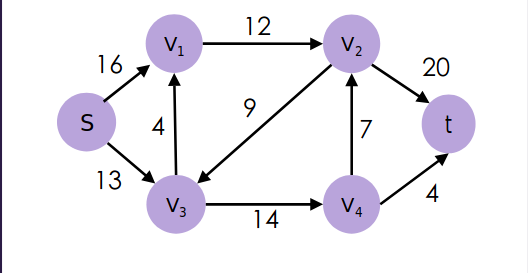
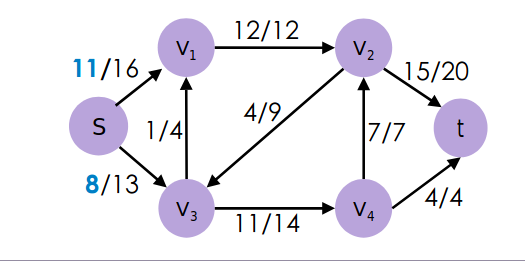
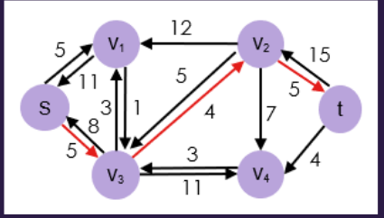
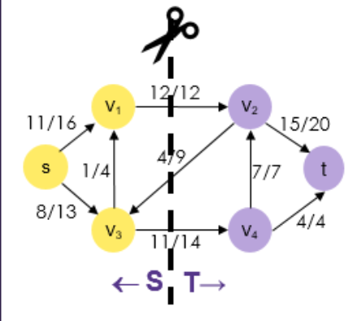

# Max Flow

## Flow Networks

Directed graphs can also be interpreted as **flow networks**.

> #### Flow Network
> A flow network $G=(V,E)$ is a directed graph in which each edge $(u,v)$ has a non-neg. capacity $c(u,v)\geq0$
> Two special vertices:
> * **source** $s$
> * **sink** $t$
> 
> 
> 
> Capacity can be represented by a function $c:V\times V\to\mathbb{R}^+$
> (edges not shown when $c(u,v)=0$)
> 
> A flow $f$ in the network $G$ is a function $F: V\times V\to \mathbb{R}^+$ satisfying:
> * $\forall u,v\in V$:
>    
>   $0\leq f(u,v)\leq c(u,v)$
> * $\forall u\in V - {s,t}$:
>    
>   $\sum_{v\in V} f(u,v) = \sum_{v\in V} f(u,v)$
> 
> The **value** $\vert f\vert$ of the flow $f$ is defined as:
> $$\vert f\vert = \sum_{v\in V} f(s,v) - \sum_{v\in V} f(v,s)$$
> i.e. the total flow out of the source, minus the total flow into source
> 
> > e.g. 
> > 
> > $\vert f\vert = f(s,v_1) + f(s,v_3) = 19$
> 
> The same network can have multiple flow functions $f_1,f_2,\dots$
> Finding a **maximum flow** is making the most of a network with certain capacities

---

## Max-Flow Problem

We are given a flow network and we fish to find a flow of maximum value.

* We can transform a network with anti-parallel edges into an equivalent network without anti-parallel edges:
  
* We can transform a network with multiple sources or sinks into an equivalent flow network with just one source and one sink:

---

## Ford-Fulkerson Method

### Definitions

> #### Residual Network
> Given a flow network $G=(V,E)$ and a flow $f$, the **residual network** induced by $f$ is $G_f$ with:
> $$E_F = \{ (u,v)\in V\times V: c_f(u,v)\geq0 \}$$
> where:
> ||||
> |-|-|-|
> |$c_f(u,v)$|$=c(u,v)-f(u,v)$|if $(u,v)\in E$
> ||$=f(v,u)$|if $(v,u)\in E$|
> ||$=0$|otherwise|
> 

> #### Augmenting Path
> An **augmenting path** is a simple path from $s$ to $t$ in the residual network $G_f$
> 
> **Residual capacity** of the augmenting path $p$:
> $c_f(p)=min \{ c_f(u,v) :$ `is on p` $(u,v) \}$
> 
> > 
> > 
> > e.g. $c_f(p) = min \{ 5,4,5 \} = 4$
> 
> If $f$ is a flow in $G$ and $f'$ is a flow in the residual network $G_f$, the augmentation of $f$ by $f'$ ($f\uparrow f'$) is defined as:
> $$f\uparrow f': V\times V \to \mathbb{R}$$
> s.t
> $$f\uparrow f' (u,v) = f(u,v) + f'(u,v) - f'(v,u)$$

### Algorithm

```
def FORD_FULKERSON_METHOD(G,s,t):
    initalize flow to f 0
    while there exists an augmentation path p in network G_f:
        augment flow f along p
```

### Time Analysis

Running time depends on the order of selecting paths $p$.

To prove a time bound:
1. Each iteration takes $O(E)$ time, where $E$ is the number of edges in the network
2. The flow value increases by at least **one** unit in each iteration
3. The number of iterations is at most $\vert f *\vert$, where $\vert f*\vert$ is the maximum flow value
4. Total running time is thus $O(\vert f*\vert E)$

### Example

---

## Edmons-Karp Algorithm

At each iteration of Ford-Fulkerson:
* pick a path from $s$ to $t$ with **minimum length** as the augmenting path $p$
  * (minimum number of edges, not maximum capacity)

THis has running time:
$$O(VE^2)$$

---

## Linear Programming

Every max-flow problem is a linear programming problem.

E.g.

|||
|-|-|
|max|$x_1+x_4$|
|s.t.|$x_1\leq7$|
||$x_2\leq6$|
||...|
||$x_1-x_2-x_3=0$|
||$x_3+x_4-x_5=0$|
||$x_1,x_2,x_3,x_4,x_5\geq0$|

---

## Cuts of Flow Networks

A $cut$ $(S,T)$ of a flow network $G=(V,E)$ is a partition of the vertex set $V$ into sets $S$ and $T=V-s$, s.t. $s\in S$ and $t\in T$.



If $f$ is a flow, the **net flow** $f(S,T)$ across a cut is defined to be:
$$f(S,T)=\sum_{u\in S}\sum_{v\in T} f(u,v) - \sum_{u\in S}\sum_{v\in T} f(v,u)$$

The **capacity** of the cut is:
$$c(S,T)=\sum_{u\in S}\sum_{v\in T} c(u,v)$$

> these impy that $f(S,T)\leq c(S,T)$

**Minimum cut**: cut whose capacity is the minimum of all cuts of $G$.

> #### Lemma
> Let f be a flow with value $\vert f\vert$ in a flow network $G$, and let $(S,T)$ be any cut of $G$.
> 
> $f(S,T) = \vert f\vert$

---

## Max Flow - Min Cut

### Theorem

The maximum flow value is equal to the minimum cut capacity.

### Proof

Suppose $f$ is a maximum flow in $G$.
By the Lemma, $\vert f\vert = f(S,T)$ for all cuts $(S,T)$ of $G$, so $\vert f\vert \leq c(S,T)$ for all cuts.

$G_f$ can't have any paths from $s$ to $t$, because if there was one you could **augment** $f$ along the path to create a folow with **greater value**.

Let $S$ be the set of $u$ in $V$ for which there's a path in $G_f$ from $s$ to $u$, and $T=V-S$.

> Suppose $u\in S, v\in T$
> 
> $(u,v)$ can't be in $G_f$, or else $v$ would be in $S$:
> * If $(u,v)\in E$ then $f(u,v)$ must equal $c(u,v)$
> * If $(u,v)\in E$ then $f(u,v)$ must equal $0$
> 
> $\vert f\vert = f(S,T) = \sum_{u\in S, v\in T} f(u,v) - \sum_{u\in S, v\in T} f(v,u)$
> 
> $= \sum_{u\in S, v\in T} c(u,v)$
> 
> $= c(S,T)$
> 
> We know that $\vert f\vert \leq c(S',T')$ for all cuts $(S',T')$ of $G$;
> 
> So $c(S,T)$ must be the minimum cut capacity.

### Example