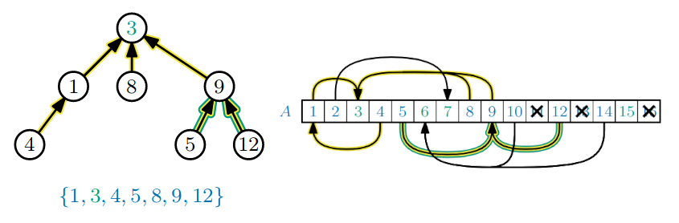

# Minimum Spanning Trees

## Disjoint Sets

The elements of the sets are numbers from $\{ 1,\dots,n \}$.

The following operations are supported:
* $makeSet(x)$ - make a new set containing only $x$
  * $x$ cannot be a member of any existing set
* $union(x,y)$ - merge the sets containing $x$ and $y$ into a single set
* $findSet(x)$ - returns the *identity* of the set containing $x$
  * the *identity* of a set is any unique identifier of the set

We require that $findSet(x) = findSet(y)$ **iff** $x$ and $y$ are currently in the same set.

---

## Reverse Trees

We store each set as a reverse tree:

This reverse tree stores the set $\{ 1,3,4,5,8,9,12 \}$

* Each node stores an element from the set.
* The **identity** of a set is the element at the *root* (here $3$)

Each element stores a pointer to its parent but **no** pointers to its children.

---

## Reverse Forests

The data structure consists of a forest of reverse trees; one for each set:

The elements are stored in an array of length $n$:

This allows us to find any element $x$ in $O(1)$ time.

### $findSet(x)$

1. Find the node storing element $x$ ($O(1)$)
2. Until you are at the *root*, follow the pointer to the parent of the current node ($O(h)$, $h$ is height)
3. Output the element at the root ($O(1)$)

Worst-case time complexity:

$$O(h)$$

### $makeSet(x)$

1. Make a new tree containing $x$ as the root ($O(1)$)

Worst-case time complexity:

$$O(1)$$

### $union(x,y)$

1. Compute $r_x = findSet(x)$ - the root of the tree containing $x$ ($O(h)$)
2. Compute $r_y = findSet(y)$ - the root of the tree containing y ($O(h)$)
3. Make $r_x$ a child of $r_y$ (which merges the two trees) ($O(1)$)

Worst-case time complexity:

$$O(h)$$

#### Problem

Each union could increase the tallest tree height, $h$, by one.

#### Improved

Always make the shorter tree the child of the taller tree

3. If $h(x) \leq h(y)$ make $r_x$ a child of $r_y$
   * else make $r_y$ a child of $r_x$

---

## Minimum Spanning Trees

In a *connected*, *undirected* graph $G$, a **spanning tree** is a subgraph $T$ s.t:
* every vertex $v\in V$ is in $T$, and $T$ is a tree (no *cycles*)
* the **weight** of a spanning tree is the *sum* of the weights of its edges

> $T$ is a **minimum** spanning tree if *no other* spanning tree has a *lower weight*

---

## Kruskal's Algorithm

Kurskal's algorithm finds a minimum spanning tree in a *connected*, *undirected* graph, using a disjoint set data structure where the elements are from $\{ 1,2,\dots,\vert V\vert\}$

1. For each $v\in V$, $makeSet(v)$
2. Sort the edges in order of increasing weight
3. For each $(u,v)\in E$ (in order)
   * if $findSet(u) =\not findSet(v)$ then $union(u,v)$ and add $(u,v)$ to $T$

If we implement the operations as we have seen, they run in $O(\log\vert V\vert)$

Overall running time:
$$O(\vert E\vert \log \vert V\vert)$$