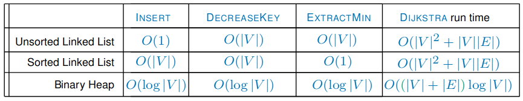

# Single Shortest Path

---

## Priority Queues

> Q contains **distinct** elements x (each with a key)
> 
> Supports:
> * ```insert(x, k)```: inserts `x` with `x.key = k`
> * ```decreaseKey(x, k)```: sets `x.key = k` where `x.key < k`
> * ```extractMin()```: removes & returns element with the **smallest key**

### Implementation

#### Unsorted Linked List

|op. | insert | decreaseKey | extractMin |
|-|-|-|-|
|time | $\mathbb{O}(1)$ | $\mathbb{O}(n)$ | $\mathbb{O}(n)$ |


Adding item on head is easy - searching for item is hard!

#### Sorted Linked List

|op. | insert | decreaseKey | extractMin |
|-|-|-|-|
|time | $\mathbb{O}(n)$ | $\mathbb{O}(n)$ | $\mathbb{O}(1)$ |

Extract min is easy (remove head of list) - increase/decrease key is hard!


#### Binary Heap

> Any element has a key **less than or equal to** the keys of its children


Can be stored implicitly as an array:


##### Assumption

This relies on the assumption that **we can find the location of any element `x` in the heap in $\mathbb{O}(1)$ time**

> Given each element `x` also has an ass. unique +ve int id; $x.id \leq N$


##### Decrease Key

`decreaseKey(x, k)`

> |Step|Time
> |-|-|
> | 1. Find element `x` |$\mathbb{O}(1)$|
> | 2. Check that $k \leq  x.key$ |$\mathbb{O}(1)$|
> | 3. Set `x.key = k`|$\mathbb{O}(1)$|
> | 4. While `x.key < parent.key`:<br> swap x w/ parent<br>*(stop if `x = root`)*  | Each swap: $\mathbb{O}(1)$;<br>Height of tree=$\mathbb{O}(\log n);$<br>$\log n$ swaps|

$\mathbb{O}(\log n)$ time

##### Insert

`insert(x, k)`

> |Step|Time
> |-|-|
> | 1. Put `x` in next free slot |$\mathbb{O}(1)$|
> | 2. Run `decreaseKey(x, k)` |$\mathbb{O}(\log n)$|

$\mathbb{O}(\log n)$ time

##### ExtractMin

`extractMin()`

> |Step|Time
> |-|-|
> | 1. Extract element at root |$\mathbb{O}(1)$|
> | 2. Root = rightmost element in bottom level (`y`) |$\mathbb{O}(1)$|
> | 3. While `y.key > children.any`:<br>swap `y` w/ child with smaller key<br>*(stop if `y` becomes a leaf)*  |$\mathbb{O}(1)$<br>Height of tree is $\mathbb{O}(\log n)$|

$\mathbb{O}(\log n)$ time

### Summary


### Heapsort

Sorting array `arr` -> `newArr`

(Given queue is a **binary heap**)

1. `|arr| = n`
1. insert every element into a priority queue
1. `extractmin` from queue `n` times
    * put elements in `newArr` in order they come out

$\mathbb{O}(n \log n)$ time

---

## Dijkstra's Algorithm

**Dijkstra's Algorithm** solves the *single shortest paths* problem in a:
* weighted (non-negative - but the paths directly from s **can** be negative)
* directed

graph (stored as an **Adjacency List**).

It finds the shortest path from a given *source* vertex to *every* other vertex.

### Algorithm

```python
def dijkstra(s):
    for all v, set dist(v) = inf
    set dist(s) = 0
    for each v do insert(v, dist(v))

    while the queue is not empty:
        u = extractMin()
        for every edge (u,v) in E: # all edges connected
            if dist(v) > dist(u) + weight(u, v): # update the distance if less
                dist(v) = dist(u) + weight(u, v)
                decreaseKey(v, dist(v))
```

> When the algorithm terminates, for each vertex $v$:
> 
> $dist(v)$ is the distance between $s$ and $v$

> #### Lemma
> Whenever a vertex $v$ is `EXTRACTED`, $dist(v) = \delta(s, v)$

---

### Time Complexity

The time complexity depends on the implementation of the priority queue.


For the setup:
* `For all v, set dist(v) = inf` $\mapsto O(\vert V\vert)$ time
* `set dist(s) = 0` $\mapsto O(1)$
* `For each v, do INSERT(v, dist(v))` $\mapsto O(\vert V\vert \cdot T_{INSERT})$

We do $O(\vert V \vert)$ iterations of the while loop and *relax* each edge at most once; overall:
$$O(\vert V\vert \cdot T_{INSERT} + \vert V\vert \cdot T_{EXTRACTMIN} + \vert E\vert \cdot T_{DECREASEKEY})$$

---

### Summary



> $\vert V\vert$ used to be $n$, but $n \leq \vert V\vert$ 

All these solutions use $O(\vert V\vert + \vert E\vert)$ **space**.