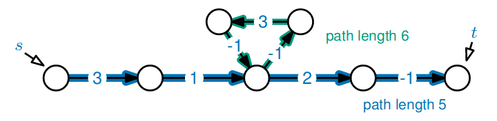

# Shortest Paths Revisited

## Negative Weights

**Bellman-Ford's** algorithm solves the single source shortest paths problem in a weighted, directed graph.

* It finds the shortest path from a given source vertex to every other vertex.
* The weights are allowed to be **positive or negative**.
* The graph is started as an adjacency list

> Reminder: Dijkstra's algorithm solves this problem in $O(\vert V\vert+\vert E\vert)\log\vert V\vert)$ time when the edges have **non-negative weights**

### Negative Weight Cycles

A negative weight cycle is a path from vertex $v$ back to $v$ s.t. the sum of the edge weights is negative.


If there is a path from $s$ to $t$ which includes a negative weight cycle, there is no shortest path from $s$ to $t$.

### Most of the Bellman-Ford Algorithm

```python
def MOSTOFBELLMAN_FORD(s):
    for all v, set dist(v) = infty
    set dist(s) = 0
    for i in range(0, len(V)):
        for every edge (u,v) in E:
            if dist(v) > dist(u) + weight(u,v): # relaxing edge (u,v)
                dist(v) = dist(u) + weight(u,v)
```
It repeatedly asks, for each edge $(u,v)$ 'can I find a shorter route to $v$ if I go via $u$?'

> Claim:
> 
> When the MOSTOFBELLMAN_FORD algorithm terminates, for each vertex v, dist(v) is the **length of the shortest path** between s and v.

### Proof Idea

> #### Imaginary Alg.
> Imagine a different algorithm where in each iteration you relax **only one** edge.
> 
> Further, imagine that the edge you relax in iteration $i$ is the $i^{th}$ edge in a shortest path from $s$ to some vertex $t$.
> 
> When this algorithm terminates, $dist(t)$ is the length of the shortest path from $s$ to $t$.

> #### MOSTOFBELLMAN_FORD
> You relax **every edge** in each iteration.
> 
> Consider the same shortest path from $s$ to $t$.
> 
> At **some point** in iteration $i$, you relax the $i^{th}$ edge in the shortest path from $s$ to $t$.
> 
> After enough iterations, $dist(t)$ is the length of a path from $s$ to $t$, which is at least as short as the shortest path.

We now prove that if are **no negative cycles** in the graph, the shortest path between $s$ and $t$ contains at most $\vert V\vert$ edges (and therefore $\vert V\vert$) iterations will be enough.

> Consider a path between $s$ and $t$ with a cycle:
> 
> As there are no negative weight cycles, deleting this cycle from the path cannot increase its length
> 
> $\therefore$ there is a shortest path between $s$ and $t$ containing no cycles
> A path with no cycles enters each vertex at most once, so contains at most $\vert V\vert$ edges

### Full Algorithm

```python
def BELLMAN_FORD(s):
    for all v, set dist(v) = infty
    set dist(s) = 0
    for i in range(0, len(V)):
        for every edge (u,v) in E:
            if dist(v) > dist(u) + weight(u,v): # relaxing edge (u,v)
                dist(v) = dist(u) + weight(u,v)
    
    for every edge (u,v) in E:
        if dist(v) > dist(u) + weight(u,v):
            print('neg. weight cycle found')
```
We added a final check which determines whether another iteration would find an even shorter path from some $s$ to some $v$.

The algorithm still works when there is **no negative weight cycle**:
> After the first $\vert V\vert$ iterations (which haven't changed), for each vertex $v$, $dist(v)$ is the length of the shortest path between $s$ and $v$.
> 
> If the final check outputs 'neg. weight cycle found', then there is a path from $s$ to some $v$ (via $u$) with length:
> $$dist(u) + weight(u,v) < dist(v)$$
> i.e. a path which is shorter than the shortest path - contradiction!

With a negative weight cycle:
> Let $v_1,\dots,v_k \in V$ be a negative weight cycle, and assume for a contradiction, that it wasn't reported by the algorithm.
> 
> In general, for every edge $(v_j,v_{j+1})$ we have:
> $$weight(v_j,v_{j+1}) \geq dist(v_{j+1}) - dist(v_j)$$
> where $v_{k+1} = v_1$
> 
> But the cycle has negative weight so:
> $$\sum_{j=1}^k weight(v_j,v_{j+1}) < 0$$
> 
> However, if we sum all the edge weights using the top expressions we get:
> $$\sum_{j=1}^k weight(v_j,v_{j+1}) \geq \sum_{j=1}^k dist(v_{j+1}) - \sum_{j=1}^k dist(v_j) = 0$$

### Time Complexity

```python
def BELLMAN_FORD(s):
    for all v, set dist(v) = infty # O(|V|)
    set dist(s) = 0 # O(1)
    for i in range(0, len(V)): # O(|V||E|) overall
        for every edge (u,v) in E:
            if dist(v) > dist(u) + weight(u,v): # relaxing edge (u,v)
                dist(v) = dist(u) + weight(u,v)
    
    for every edge (u,v) in E: # O(|E|) overall
        if dist(v) > dist(u) + weight(u,v):
            print('neg. weight cycle found')
```
$$\therefore O(\vert V\vert\vert E\vert)$$

---

## All-Pairs

What do we do to find the shortest paths from **every** vertex to **every other** vertex?

We could reuse:
* non-negative edge weights:
  * run `DIJKSTRA`'s $\vert V\vert$ times; once with each vertex as the source
  * this takes $O(\vert V\vert\vert E\vert \log\vert V\vert)$ time
* negative edge weights:
  * run `BELLMAN_FORD` $\vert V\vert$ times; once for each vertex
  * this takes $O(\vert V\vert^2\vert E\vert)$ time

The output contains the length of the shortest path between every pair of vertices.

There are $\vert V\vert \cdot (\vert V\vert -1)$ pairs of vertices, so we can't expect to do better than $O(\vert V\vert^2)$ time.

If we imagine $\vert E\vert \approx 5\vert V\vert$ (the graph is very spare), e.g. each vertex has an edge to about $5$ other vertices, Dijkstra's takes $O(\vert V\vert^2\log\vert V\vert)$ time (a lot better than the graph being dense).

### `JOHNSON`'s Algorithm

This works for positive and **negative** edge weights, and uses both `DIJKSTRA`'s and `BELLMAN_FORD`.

Time complexity:
$$O(\vert V\vert\vert E\vert \log\vert V\vert)$$


The approach employed by `JOHNSON`'s algorithm is to **reweight** the edges, so that the resulting graph has **non-negative edge weights** (and then repeatedly runs `DIJKSTRA`'s algorithm).

### First Attempt

One natural attempt is to increase every edge weight by the same amount.


Unforunately, both the shortest paths lengths and the routes might change.

### Reweighting Based on Vertex Potential

To overcome this, we're going to reweight each edge differently - the new weight of each edge will depend on **which vertices it connects**.

$h(v)$ is the potential of a vertex $v$.


where $weight'(A,B)=weight(A,B) + h(A) - h(B)$

> #### Example
> 
> This path has length $13$.
> 
> This path has length $14 = 13 + 5 - 4 = 13 + h(v_1) - h(v_6)$
> 
> > Original graph path length:
> > $$\sum_{i=1}^{k-1} weight(v_i,v_{i+1})$$
> > 
> > Reweighted graph path length:
> > $$\sum_{i=1}^{k-1} weight'(v_i,v_{i+1})$$
> > $$= \sum_{i=1}^{k-1} weight(v_i,v_{i+1} + h(v_i) - h(v_{i+1}))$$
> > $$= \sum_{i=1}^{k-1} weight(v_i,v_{i+1}) + h(v_1) - h(v_k)$$
> > $\therefore$ the weight of a path only changes by the potential values of the end points

### Reweighted Shortest Paths

Let the function $h$ give a value $h(v)$ for each vertex $v \in V$.

Change the weight of every edge $(u,v)$ to be:
$$weight'(u,v)=weight(u,v)+h(u)-h(v)$$

> #### Lemma
> Any path is a shortest path in the **original** graph, iff it is a shortest path in the **reweighted** graph
> 
> $$l_1 \leq l_2$$
> iff
> $$l_1 + h(u) - h(v) \leq l_2 + h(u) - h(v)$$

### Reweighted Negative Cycles


The weight of this cycle in the original graph is:
$$\sum_{i=1}^k weight(v_i,v_{i+1}) < 0$$

The weight of this cycle in the reweighted graph is:
$$\sum_{i=1}^k weight'(v_i,v_{i+1}) = \sum_{i=1}^k weight(v_i,v_{i+1}) + h(v_1) - h(v_1) \therefore < 0$$

Reweighting doesn't affect negative cycles.

### Choosing $h$

1. Add one additional vertex called $s$ to the original graph
2. Add an edge $(s,v)$ from $s$ to each other vertex $v\in V$; each of these edges has weight $0$
3. For each $v$, let $\delta(s,v)$ denote the length of the shortest path from $s$ to $v$
   * define $h(v)$ to equal $\delta(s,v)$
4. Consider any edge $(u,v)\in E$
   
   $$\delta(s,v) \leq \delta(s,u) + weight(u,v)$$

   > This follows because there is a path from $s$ to $v$ via $u$, with length $\delta(s,u) + weight(u,v)$
   > 
   > So the shortest path can't be longer

   Rearranging, we have:
   $$weight(u,v) + \delta(s,u) - \delta(s,v) \geq 0$$

   The new weight of an edge $(u,v)$ becomes:
   $$weight'(u,v) = weight(u,v) + h(u) - h(v)$$
   $$ = weight(u,v) + \delta(s,u) - \delta(s,v) \geq 0$$
   So all the reweighted edges are non-negative

### The Algorithm

We can ***finally*** write the algorithm:
1. Add one additional vertex $s$ to the original graph
   > $O(1)$ 
2. For each vertex, add an edge $(s,v)$ with weight $0$
   > $O(\vert V\vert)$ 
3. Run the `BELLMAN_FORD` algorithm with source $s$
   * this calculates the shortest path lengths $\delta(s,v)$ for all $v$
   > $O(\vert V\vert\vert E\vert)$ 
4. Reweight each edge $(u,v)\in E$ so that
   $$weight'(u,v) = weight(u,v) + h(u)-h(v)$$
   where for all $v,h(v) = \delta(s,v)$
   > $O(\vert E\vert)$ 
5. For each vertex $u\in V$, run `DIJKSTRA`'s algorithm with source $s=u$
   * this calculates the shortest path lengths $\delta'(u,v)$ for all $u,v$
   > > $O(\vert V\vert\vert E\vert\log \vert V\vert)$ overall
6. For each pair of vertices $u,v \in V$, compute
   $$\delta(u,v) = \delta'(u,v) + h(v) - h(u)$$
   * this will give the original path lengths
   > $O(\vert V\vert^2)$

Overall time complexity:
$$O(\vert V\vert\vert E\vert\log\vert V\vert)$$