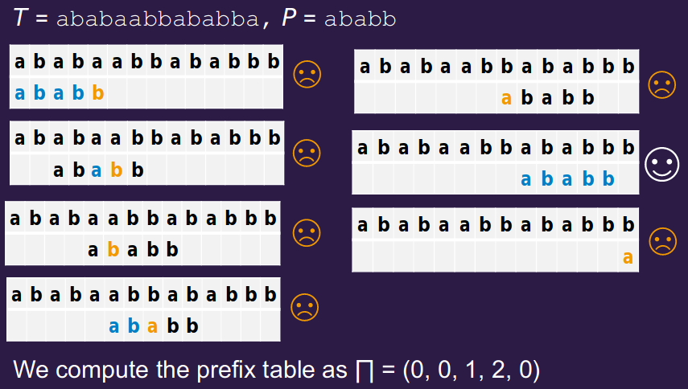

# String Matching

We want to find all the occurrences of a string $P$ in a larger string $T$.

This is a simple problem - the complexity comes in the usage of time and space.

---

## Naive

### Algorithm

1. Match pattern string against input string, character by character
2. If there is a mismatch, shift the input string down by one character in relation to the pattern string and restart at the first character of $P$

```python
def NAIVE(pat: str, inp: str) -> int:
    for i in range(0, len(inp)):
        if pat == inp[i:i + len(pat)]:
            print(i)
```

### Analysis

Worst-case:
* `inp`=`aaaa..aa` length $n$
* `pat`=`aaaa..ab` length $m$

The total number of comparisons is $(n-m+1)m$
$$\Rightarrow \Theta(n^2)$$
if $m = \frac{n}{2}$

---

## Knuth-Morris-Pratt (KMP)

When a mismatch occurs at index $q+1$ in the naive method, we have found $q$ characters that **do** match.

### Intution
* `ababb` mismatches at the $5^{th}$ character
* the matched text consists of `abab?`, where `?` is not `b`
* we restart the match by comparing the 3rd character, `a`, against `?`

### Algorithm

1. Compute the **prefix table**

This only takes $O(m)$ time:

```python
def KMP_PREFIX(pat: str) -> []:
    pre[1] = 0
    k = 0
    for q in range (2, len(pat)): # loop through the pattern
        while k > 0 and pre[k+1] != pre[q]:
            k = pre[k] # reset match
        if pre[k+1] == pre[q]:
            k = k + 1 # next character matches
        pre[q] = k
    return pre
```

> #### Example
> 
> `pat='ababb'`
> 
> 1. `pre[1]=0, k=0`
> 1. `q=2, k=0` and `pat[k+1] != pat[q]` so `k` is unchanged; `pre[2] = 0` 
> 1. `q=3, pat[k+1] = pat[q]` so `k` becomes `1`; `pre[3] = 1`
> 1. `q=4, pat[k+1] = pat[q]` so `k` becomes `2`; `pre[4] = 2`
> 1. `q=5, k>0 and pat[k+1] != pat[q]` so `k` becomes `pre[2] = 0`
>    * `k=0` and `pat[k+1] != pat[q]` so `k` is unchanged; `pre[5]=0`

1. Run the **KMP matcher**

```python
def KMP_MATCHER(pat: str, inp: str):
    pre = KMP_PREFIX(pat)
    q = 0 # no. characters matched
    for i = 1 to len(inp):  # scan the text from L to R
        while q > 0 and pat[q+1] != inp[i]
            q = pre[q]
        if pat[q + 1] == inp[i]
            q = q + 1 # next character matches
        if q == len(pat)
            print(i-len(pat)) # pattern at shift (i-m)
            q = pre[q] # look for next match
```

> #### Example
> 

### Analysis

* There are at most `len(inp)` comparisons that are either successful, or unsuccessful with $q=0$
* The value of $q$ increases only after a successful comparison, when it increases by $1$. It decreases after each unsuccessful comparison with $q > 0$
* $q$ is never $< 0$ - there are at most $n$ unsuccessful comparisons with $q > 0$
$\therefore$ there are no more than $2n$ comparisons

$$\Rightarrow O(n)$$

### Summary

* The KMP algorithm never needs to **back-track** in the input text; good for streamed text
* The average worst performance is not much better than the worst.
* Best performance when the alphabet is small - higher chance of repeated substrings in the input and pattern

---

## Boyer-Moore-Horspool (BMH)

Improvement on KMP for **large alphabets**.

## Algorithm

* use the alphabet that makes up the pattern & input text to skip *large* distances
* make comparisons starting on the **right** of the pattern
* decide the shift only by looking at the **text** element lined up with rightmost of the pattern

### Bad Match Table

* build a table giving, for each **letter** in the alphabet, the rightmost occurance of the letter in the pattern
  * also need to know second rightmost occurence of last letter

#### Example

`pat = 'TOOTH'`

`value = length - index - 1`

|letter|T|O|H|*|
|-|-|-|-|-|
|value|1|2|5|5|

### Summary

Works best when the input has a **large alphabet** and **little repitition**

Worst case:
* $pat = ba^{m-1}, inp = a^n$
$$\Rightarrow m(n-m+1)$$

Best case:
$$\Rightarrow \lfloor \frac{n}{m} \rfloor$$

---

## Finite State Machine (FSM)

We can use FSMs to search for matches for regular expressions - KMP/BMH aren't suitable, as the pattern is not finite so you cannot pre-compute the tables.

Regular expressions are used a lot to convert security logs into a common event format.

### Algorithm

```python
def FSM_MATCHER(txt: str, pat: str) -> str:
    trans = FSM_BUILD(pat)
    s = 0
    for i in range(1, len(txt)):
        s = trans(s, txt[i])
        if isAcceptingState(s):
            print(i-len(pat))
```

---

## Conclusion

|Algorithm|Pre-Comp.|Matching|
|-|-|-|
|Naive||$O(m(n-m+1))$|
|KMP|$O(m)$|$O(n)$|
|BMH|$O(m+ \vert\Sigma\vert)$|$O(m(n-m+1))$|
|FSM|$O(m \vert\Sigma\vert)$|$O(n)$|

* One-off matches on small strings $\to$ use **Naive**
* Complex pattern $\to$ use **FSM**
* String pattern w/ *large alphabet* $\to$ use **BMH**
* String pattern w/ *small alphabet* $\to$ use **KMP**