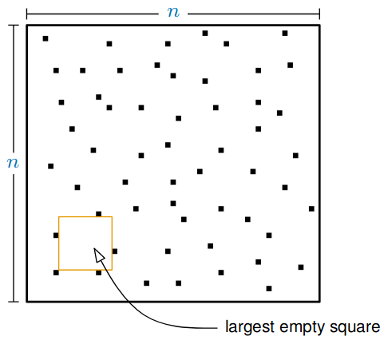
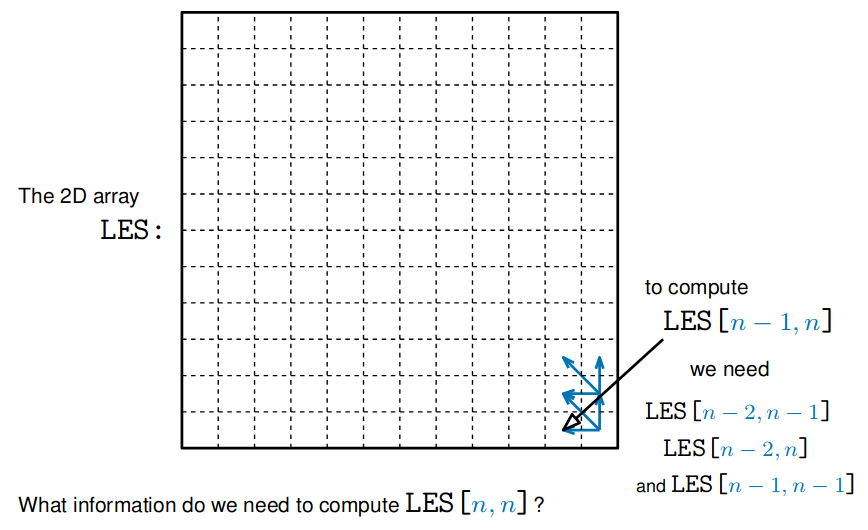
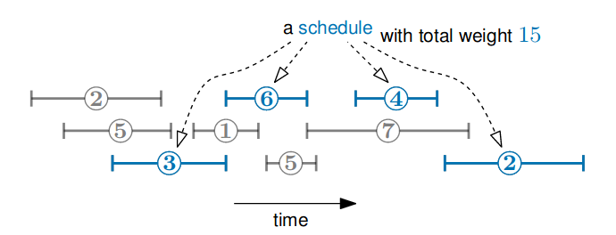
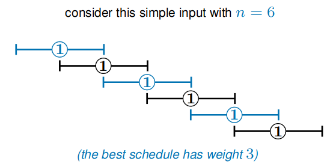
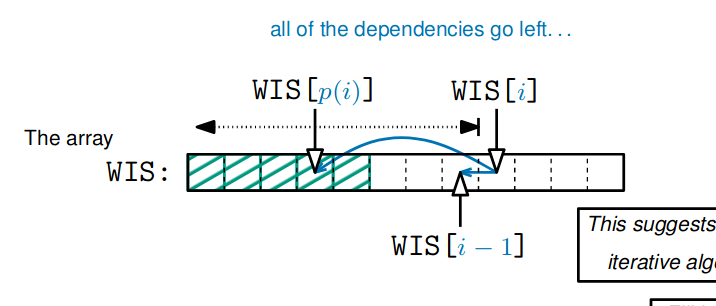

# Dynamic Programming

Dynamic programming is a technique for finding efficient algorithms for problems which can be broken down into simpler, overlapping subproblems.

Basic idea:

1. Find a **recursive formula** for the problem, in terms of answers to *subproblems*
2. Write down a naive **recursive** algorithm
3. Speed it up by **storing** the solutions to subproblems
4. Derive an **iterative algorithm** by solving the subproblems in a good order

Dynamic Progamming is **recursion without repetition**.

## Largest Empty Square

Given an $n\times n$ monochrome image, find the **largest empty square**.



### Find a Recursive Formula

> Any $m\times m$ square of pixels, $S$ is empty iff
> * The bottom-right pixel of $S$ is empty
> * The three $(m-1)\times(m-1)$ squares in the top-left, > top-right and bottom-left of $S$ are empty

Let $LES(x,y)$ be the size of the largest empty square whose bottom right is at $(x,y)$

Then:
* If the pixel $(x,y)$ is not empty, then $LES(x,y)=0$
* If $(x,y)$ is empty and in the first row or column, $LES(x,y)=1$
* If $(x,y)$ is empty and not in the first row or column,
  
  $LES(x,y)=min(LES(x-1,y-1),LES(x-1,y),LES(x,y-1))+1$

### Write Down a Recursive Algorithm

We can use the recursive formula to get a recusrive algorithm:

```python
def LES(x,y):
    if pixel (x,y) is not empty:
        return 0
    if x == 1 or y == 1
        return 1
    return min(LES(x-1,y-1), 
               LES(x-1, y),
               LES(x,y-1)) + 1
```

This computes the size of the largest empty square whose bottom right is at $(x,y)$.

$\therefore$ the maximum of $LES(x,y)$ over all $x$ and $y$ gives the size of the largest empty square in the whole image.

#### Efficiency

The running time of $LES(n,n)$ is currently **exponential** in $n$.

### Store the Solutions to Subproblems

```python
def MEMLES(x,y):
    if pixel (x,y) is not empty:
        return 0
    if x == 1 or y == 1
        return 1
    if LES[x,y] undefined:
        LES[x,y] = min(LES(x-1,y-1), 
                       LES(x-1, y),
                       LES(x,y-1)) + 1
    return LES[x,y]
```

In this version of the algorithm, we store solutions ot previously computed subproblems in an $(n\times n)$ 2D array called `LES`.

This is called **memoization**.

Now, each entry `LES[x,y]` is only computed *once*.

The time complexity of computing `MEMLES(n,n)` is now $O(n^2)$  

#### The Dependency Graph

Example:



To use this to get an iterative algorithm, fill in the array from the top-left.

### Derive an Iterative Algorithm

```python
def ITLES(n):
    for y in range(1,n):
        for x in range(1,n):
            if pixel (x,y) is not empty:
                LES[x,y] = 0
            elif x==1 or y==1:
                LES[x,y] = 1
            else:
                LES[x,y] = min(LES(x-1,y-1), 
                               LES(x-1, y),
                               LES(x,y-1)) + 1
```

This **iterative** version of the algorithm runs in $O(n^2)$ time, and avoids making any recursive calls.

---

## Weighted Interval Scheduling

Given $n$ weighted intervals, find the **schedule** with *largest total weight*.



* Two intervals are **compatible** if they don't overlap
* A schedule is a set of **compatible** intervals
* The weight of a **schedule** is the sum of the weight of the intervals it contains

The intervals are given in an array $A$ of length $n$.

$A[i]$ stores a triple $(s_i,f_i,w_i)$ which defines the $i^{th}$ interval.

The intervals are sorted by finish time, i.e. $f_i \leq f_{i+1}$.

> For all $i$:
> 
> Let $p(i)$ be the rightmost interval (in order of finish time) which finishes before the $i^{th}$ interval but doesn't overlap it.
> If no such interval exists, $p(i)=0$
> 
> **Claim**: we can precompute all $p(i)$ in $O(n\log n)$ > time

### Find a Recursive Formula

Consider some optimal schedule $\mathbb{O}$ for intervals $\{1,\dots,n\}$ with weight $OPT$;

In particular, consider the $n^{th}$ interval:

Either the $n^{th}$ interval is in schedule $\mathbb{O}$ or it isn't; there are two cases:
1. The $n^{th}$ interval is not in $\mathbb{O}$
   
   Schedule $\mathbb{O}$ is also an optimal schedule for the problem, with the input consisting of intervals ${1,\dots,n-1}$

   So, in this case we have that $OPT=OPT(n-1)$
   > $OPT(i)$ is the weight of an optimal schedule for intervals $\{ 1,\dots,i \}$
2. The $n^{th}$ interval is in $\mathbb{O}$
   
   The only other intervals which could be $\mathbb{O}$ are $\{1,\dots,p(n)\}$ *(the ones which don't overlap the $n^{th}$ interval)*

   Schedule $\mathbb{O}$ with interval $n$ removed gives an optimal schedule for the intervals $\{ 1,\dots,p(n) \}$

   So we have that $OPT=OPT(p(n)) + w_n$
   > $w_n$ is the weight of interval $n$

The case is the bigger one:

$$OPT(i)=max(OPT(i-1),OPT(p(i)) + w_i)$$

They both always give viable schedules.

### Write Down a Recursive Algorithm

```python
def WIS(i):
    if i==0:
        return 0
    return max(WIS(i-1), WIS(p(i) + w_i))
```

This computes the weight of an optimal schedule for intervals $\{ 1,\dots,i \}$;

$\therefore$ `WIS(n)` gives the weight of the optimal schedule (for the full problem).

#### Efficiency



`WIS(n)` runs in exponential time for this.

### Store The Solutions to Subproblems

```python
def WIS(i):
    if i==0:
        return 0
    if WIS[i] undefined:
        WIS[i] = max(WIS(i-1), WIS(p(i) + w_i))
    return WIS[i]
```

For this, we store solutions to previously computed subproblems in an $n$ length array called `WIS` *(we have memoized the algorithm)*.

* Each entry `WIS[i]` is only computed once
* The time complexity of computing `MEMWIS(n)` is now $O(n)$, because every recursion causes an unfilled entry to be filled in the array

#### The Dependency Graph



To compute `WIS[i]` we need `WIS[i-1]` and `WIS[p(i)]`, both of which are to the **left** of `WIS[i]`.

### Derive an Iterative Algorithm

```python
def ITWIS(n):
    if i==0:
        return 0
    for i in range(1,n):
        WIS[i] = max(WIS[i-1], WIS[p(i)] + w_i)
    return WIS[i]
```

This is an iterative dynamic programming algorithm for Weighted Interval Scheduling - it runs in $O(n)$ time.

But requires that you **precomputed** all the $p(i)$ values.

### Finding the $p(i)$ Values:

Claim: We can precompute any $p(i)$ in $O(\log n)$ time:

We want to find the unique value $j=p(i)$ s.t.:
$$f_j < s_i < f_{j+1}$$
As the input is sorted by finish times, we can find $j$ by binary search in $O(\log n)$ time.

> Claim: We can precompute any $p(i)$ in $O(n\log n)$ time
> 
> *(by using the revised claim $n$ times)*

### The Actual Algorithm

`ITWIS(n)` finds the weight of the optimal schedule, but doesn't find the actual schedule.

```python
def FINDWIS(i):
    if i==0:
        return None
    if WIS[i-1] <= WIS[p(i)] + w_i:
        return FINDWIS(p(i)) then i
    return FINDWIS(i-1)
```

This is called **backtracking**.

1. Find all the $p(i)$ values - $O(n\log n)$
2. Run `ITWIS(n)` to find the optimal weight - $O(n)$
3. Run `FINDWIS(n)` to find the schedule - $O(n)$

Overall this takes $O(n\log n)$ time.