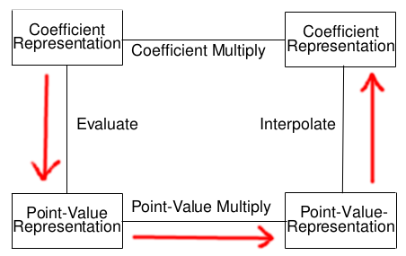
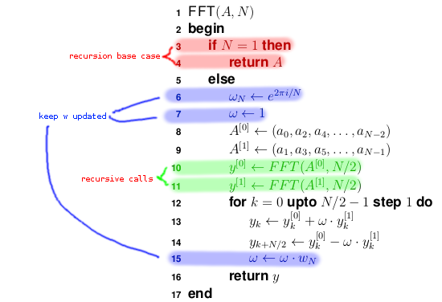

# FFT

## Multiplying Two Large Poly. With Fourier Transforms

### Polynomials

> Degree $n-1$ poly.:
> $$A(x) = \Sigma_{i=0}^{n-1} a_i \cdot x^i$$
> * coefficients $= a_i$
> * degree $= n-1$
> * n is *one* example **degree bound**
>   * any int. $>$ degree of poly. is a **degree bound**

You can express an integer as a poly. by setting x to some base, e.g.
$$A = \Sigma^{n-1}_{i=0} a_i \cdot 10^i$$
$x$ allows us to evaluate a poly. at some point - plug a value into $x$
* e.g. $A(3) = a_0 \cdot 3^0 + a_1 \cdot 3^1 \dots$

> #### Horner's Rule
> Instead of computing all terms individually, we do:
> $$A(3) = a_0 + 3(a_1 + 3(a_2 + \dots + 3(a_{n-1}))$$
> which requires $O(n)$ operations
> ```python
> def eval_horner(A,n,x):
>     t=0
>     for i in range(n-1, 0, -1):
>         t = (t * x) + A[i]
>     return t
> ```

### Polynomial Arithmetic

#### Coefficient Based:

$C = A+B$ constructs $C$ as the vector:
$$(a_0 + b_0, a_1 + b_1, \dots, a_{n-1} + b_{n-1})$$

#### Point Based:

> Given $n$ points $(x_i, y_i)$ with all $x_i$ distinct, there is a unique poly. $A(x)$ of degree bound $n$ s.t.
> $$y_k + A(x_k)\quad|\quad k=0,\dots,n-1$$

$C = A + B$ constructs $C$ as the vector:
$$\{ (x_0,y_0 + z_0),(x_1,y_1 + z_1), \dots \}$$
where $x_i$ is a point; $y_i = A(x_i)$; $z_i = B(x_i)$

* this must use the same eval points
* has complexity $O(n)$

### Polynomial Multiplication

#### Coefficient Representation

Basically just long multiplication.

$C = A \times B:$

$$C(x) = \sum^{2n-2}_{i=0} c_i \cdot x_i$$
where
$$c_i = \sum^{i}_{j=0} a_j \cdot b_{i-j}$$

This has complexity $O(n^2)$

#### Point-based Representation

$C = A \times B:$

$$\{ (x_0, y_0 \cdot z_0),(x_1,y_1 \cdot z_1), \dots \}$$
where:
* $x_i$ is a point
* $y_i = A(x_i)$
* $z_i = B(x_i)$

This has complexity $O(n)$

### Idea



Point-value is still $O(n)$ - we should traverse around this diagram
* The opposite of evaluation is **interpolation**

> **Idea**:
> 1. Evaluate to point-value repr.
> 2. Multiply
> 3. Interpolate back
> 
> Is this quicker than normal multiplication?

We want two fast algorithms to:

1. **evaluate** $A(x_0),A(x_1),\dots,A(x_{n-1})$
2. **interpolate**: given $A(x_0),\dots,A(x_{n-1})$, reconstruct $A$'s coefficients $a_0,\dots,a_{n-1}$

for a given algorithm and preselected set $x_0, x_1,\dots, x_{n-1}$ of numbers

---

### Main Idea

1. **Double degree-bound**: create coefficient repr. of $A(x)$ and $B(x)$ as degree-bound $2n$ poly. by adding $n$ higher order coeff. to both
2. **Evaluate**: compute point-value repr of $A(x)$ and $B(x)$ of length $2n$ through two applications of the *FFT* of order $2n$
3. **Point-wise Multiply**: compute a point-wise repr. of $C(x) = A(x) \times B(x)$ by multiplying the values point-wise
4. **Interpolate**: create a coeff. repr. $C(x)$ through a single applications of the *reverse FFT*

The $1^{st}$ and $3^{rd}$ steps are $O(n)$
The $2^{nd}$ and $4^{th}$ steps are $O(n \log n)$ (if we evaluate at the *complex roots of unity*)

### Evaluation

We should select the points we want to evaluate at to be the $N^th$ complex *Roots of Unity*
* we know that $\omega_N = e^{\frac{2\pi j}{N} i}$ for $j=0,\dots,n-1$
* so we should evaluate at $\omega_n^0,w_n^1,w_n^{n-1}$

$$\omega^j_N = e^{\frac{2\pi j}{N} i}\quad |\quad j=0,...,n-1$$

So we evaluate:

$$A(x) = \sum_{j=0}^{n-1} a_j \omega_n^{kj}$$
for every $k=0,1,\dots,n-1$

The vector of results of these evaluations:
$$y_k=A(\omega^k_n)$$
This vector is the **Discrete Fourier Transform** DFT of the coeff. vector $a = (a_0,a_1,\dots,a_{n-1})$

> #### Example
> The **DFT** of $0 + 0x + x^2 - x^3$
> 
> is $0, -1 + i, 2, -1 -i$

---

## FFT

### Lemmas

> #### Cancellation Lemma:
> $$\omega^{dk}_{dN} = \omega^k_N$$

> #### Halving Lemma:
> 
> If $N>0$ is even, the *squares* of the the $N$ complex $N^{th}$ roots of unity are the:
> 
> $\frac{N}{2}$ complex $\frac{N}{2}^{th}$ roots of unity
> > It follows that if we square all the $n^{th}$ roots of unity, then each $\frac{n}{2}^{th}$ root of unity is obtained exactly twice;
> > $$(\omega^0_N)^2,(\omega^1_N)^2,\dots,(\omega^{N-1}_N)^2$$
> > consists of not $n$ **distinct** values, but only of $\frac{n}{2}$ values, each of which occurs exactly **twice**

### Idea

The basic idea is to define two new polynomials:
$$A^{[0]}(x) = a_0 + a_2(x) + \dots + a_{N-2}x^{\frac{N}{2}-1}$$
$$A^{[1]}(x) = a_1 + a_3(x) + \dots + a_{N-1}x^{\frac{N}{2}-1}$$
and use these to divide and conquer the problem.

From the above, we have:
$$A(x) = A^{[0]}(x^2) + x \cdot A^{[1]}(x^2)$$

The problem of evaluating $A$ at $\omega^0_N,\dots,\omega^{N-1}_N$ is reduced to evaluating $A^{[0]}$ and $A^{[1]}$ at the points:
$$(\omega^0_N)^2, (\omega^1_N)^2, \dots, (\omega^{N-1}_N)^2$$
then combining the results.

The Halving Lemma tells us there are only $\frac{N}{2}$ complex $\frac{N}{2}^{th}$ roots of unity - each one must occur **twice**.

> #### Example
> Consider $A[X] = 0 + 0x + 1x^2 - x^3$:
> $$A^{[0]} = a_0 + a_2x = 0 + 1x$$
> $$A^{[1]} = a_1 + a_3x = 0 - 1x$$
> We can check by seeing that:
> $$A[x] = A^{[0]}[x^2] + xA^{[1]}[x^2]$$
> $$= 0 + 1x^2 + x(0-1x^2)$$
> $$= x^2 - x^3$$

Polynomials $A^{[0]}$ and $A^{[1]}$ of degree-bound $\frac{n}{2}$ are recursively evaluated at the $\frac{n}{2}$ complex $\frac{n}{2}^{th}$ roots of unity
* these subproblems have exactly the same form as the original
* however, they are **half** the size because of the halving lemma
* so we can divide an $n$-element DFT computation into two $\frac{n}{2}$ element DFT computations and combine the results in linear time
* this should remind you of merge sort

### Algorithm

We define $A^{[0]}$ and $A^{[1]}$ and then recursively evaluate them.



For $y_0,y_1,\dots,y_{\frac{n}{2}-1}$:
$$y_k = y_k^{[0]} + \omega_n^k y_k^{[1]}$$
$$= A^{[0]}(\omega^{2k}_n) + \omega^k_n A^{A[1]} (\omega^{2k}_n)$$
$$= A(\omega^k_n)$$

For $y_{\frac{n}{2}},y_{\frac{n}{2}}+1,\dots,y_{n-1}$:
$$y_{k+\frac{n}{2}} = y_k^{[0]} - w_n^k y_k^{[1]}$$
$$= \dots$$
$$= A(\omega_n^{k+\frac{n}{2}})$$

> #### Example
> Consider $A[x] = 0 + 0x + 1x^2 - x^3$:
> 
> N = 4, so we need to compute the four $4^{th}$ roots of unity.
> 
> *Line 7*: sets $\omega$ to $1$, as $1$ is always the first root.
> 
> $w_4 = \cos(\frac{\pi}{2}) + i\sin(\frac{\pi}{2}) = i$
> 
> $$A^{[0]} = (0, 1)$$
> $$A^{[1]} = (0, -1)$$
> $$y^{[0]} = FFT((0,1),2)$$
> $$y^{[1]} = FFT((0,-1),2)$$
> > $FFT((0,1),2)$ is simply the two squares roots of unity, i.e. $(1,-1)$
> > 
> > $FFT((0,-1),2)$ is simply $(-1,1)$
> The first iteration of the loop from *line 12* gives us:
> $$y_0 = 1 + (-1)=0$$
> $$y_2=1 - (-1) = 2$$
> Now we update $\omega = i$ on *line 15* and perform the second loop:
> $$y_1 = -1 + i$$
> $$y_3 = -1 - i$$
> So the 4 point FFT of $A[x] = x^2-x^3$ is $0, -1 + i, 2, -1-i$

### Analysis

* Each recursive call in lines $10-11$ call FFT with a coefficient vector of length $\frac{n}{2}$
* Lines $13-14$ take $\Theta(n)$ time to compute in total;

The running time is therefore:
$$T(n) = 2T(\frac{n}{2}) = \Theta(n)$$
$$= \Theta(n log n)$$

### Summary

We wanted to evaluate two polynomials $A,B$ of degree-bound $n$ at the roots of unity.
We also needed to double the degree-bound to help us perform mult. later on.
1. Pad the coeff. vector for A with zeros, so their length is $2n$
2. Define $A(x) = \sum^{2n-1}_{i=0} a_i \cdot x^i$ (half the coeff. are $0$)
3. Define $y_j = A(\omega^j_n) = \sum^{n-1}_{i=0} a_i \cdot w^{ji}_n$
4. Then the vector $y=(y_0,y_1,\dots,y_{2n-1}$ is the $2n$-element DFT of $A$
5. We have our point-value representation as:
$$\{ (\omega^0_{2n}, y_0), (\omega^1_{2n},y_1),\dots,(\omega^{2n-1}_{2n},y_{2n-1}) \}$$
Repeat the process for poly $B$.

### Inverse Fourier Transform

We will use the **Inverse DFT** to interpolate polynomials - this relies on a theorem that shows how to invert the DFT:
$$a_i = \frac{1}{n} \sum_{j=0}^{n-1} y_j \cdot w_n^{-ji}$$
This allows us to convert the point-value representation of a polynomial to coefficient form.

* switches roles of $a$ and $y$
* replaces $\omega_n$ by $\omega_n^{-1}$
* divides the final result by $n$
$\therefore$ the **Inverse DFT** can be computed in the same time complexity as the DFT - $O(n\log n)$

## Conclusion

The overall time complexity of polynomial multiplication is $O(n \log n)$