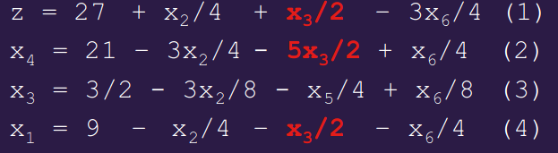

# Linear Programming

Linear Programming is optimising a **linear function**, subject to a set of **linear inequalities**.
* **linear function** ex: $5+3x+4y$
* **linear inequality** ex: $5x+2y-6z\geq3$

Optimizing a function is finding the **minimum** or **maximum** value.

* **infeasible** - program has no feasible solutions
  * e.g. maximize $x+y$
    
    subject to $5x+2y \geq 7$

    $\qquad\qquad x\leq0, y\leq0$
* **unbounded** - program has some feasible solutions but does not have a finite optimal objective value
  * e.g. maximise $x+y$
    
    subject to $2x-5y\leq 7$

    $\qquad\qquad x-3y\leq4$

    $\qquad\qquad x-y\geq0$

> For the linear program:
> > Maximize $x-y$
> > 
> > Subject to $5x+2y\geq7$
> > 
> > $\qquad\qquad-3x+y\leq4$
> > 
> > $\qquad\qquad8x+y\leq24$
> > 
> > $\qquad\qquad x,y\geq0$
> The search is for a feasible solution that maximizes the objective function $x-y$
> 
> 
> 
> The objective function takes different values at different parts of the feasible region
> 
> |||
> |-|-|
> |$x-y=-8$||
> |$x-y=-2$||
> |$x-y=10$||

---

## Example

---

## `SIMPLEX` Algorithm

Takes a linear program as input, returns an **optimal solution**.

1. Starts at vertex of **feasible region**, performs a sequence of iterations
   * the **feasible region** is given by a set of linear inequalities; the local optimum is the global optimum
2. At each iteration:
   * moves along an edge to a neighbouring vertex whose objective value is **better** than the current vertex
3. Terminates when it reaches a **local optimum**

> #### Non-standard Form
> A problem is in **non-standard** form for the Simplex Algorithm if **one** of the following holds:
> * the problem is to **minimize** rather than maximize the objective function
> * there are variables without non-negativity constraints
> * there are constraints with equality rather than inequalities
> * there are inequality constraints which need to change between $\geq$ and $\leq$

> #### Converting to Standard Form
> 1. If the problem is a minimization rather than a maximization, negate the coefficients of the objective function
> > e.g. `minimize`$-2x+3y$
> > 
> > becomes `maximize`$2x-3y$
> 2. If the variable $y$ does not have the constraint $y\geq0$, change $y$ to $y_1-y_2$ and add $y_1\geq0,y_2\geq0$
> > e.g. 
> > 
> 3. Change the equality into a **pair** of inequalities, $\leq$ and $\geq$;
> 
>    **Split** up constraints with more than one inequality
> > e.g.
> > 
> 4. If inequality needs to change from $\geq$ to $\leq$, negate both sides
> > e.g. 
> > 
> 
> > Example:
> > ||||
> > |-|-|-|
> > ||$\rightarrow$||

After receiving a linear programming problem in standard form, the Simplex algorithm puts it into **slack form**.

In slack form, you aim to maximize $z$, and there are constraints $x_i\geq0$ for all the other variables.

> #### Converting to Slack Form
> Introduce a new variable $z$ equal to the objective function.
> For each inequality $\sum_{i\leq j\leq n} a_{ij} x_j \leq b_i$
> * introduce a new variable $x_{n+i}$
> * rewrite the inequality as:
>   $$x_{n+i}=b_i - \sum_{1\leq j\leq n} a_{ij} x_j$$
> 
> > Example:
> > 
> > ||||
> > |-|-|-|
> > ||$\rightarrow$||

* **basic variables** - the variables other than $z$ on the **left** hand side of the equalities in a slack form
* **nonbasic variables** - the variables on the right hand side of the equalities

---

## Basic Solution

The **basic solution** can be found by setting all nonbasic variables to $0$.

If all constants in equations for variables other than $z$ are $\geq0$, this is a feasible solution (a vertex of the feasible region).

> #### Example
> 
> 
> $\rightarrow x = (0,0,0,30,24,36)$, $z=0$

### Iteration

At each iteration in the simplex algorithm, we select a **non-basic** variable $x_i$ with a **positive** coefficient in the objective function.

Increasing its value would increase the objective function.

Let's choose $x_1$:

We try to increase $x_1$ as much as possible without breaking any non-negativity constraint.
* $(2)$: $x_1$ could be set to $30$ max
* $(3)$: $x_1$ could be set to $12$ max
* $(4)$: $x_1$ could be set to $9$ max

Equation $(4)$ is the tightest constraint - its basic variable is $x_6$.

We will exchange roles of $x_1$ and $x_6$.

* We rearrange $(4)$ so $x_1=9-\frac{x_2}{4} - \frac{x_3}{2} - \frac{x_6}{4}$ and substitute RHS for $x_1$ in the other equations.
* $x_1$ will no longer be on the right hand side of equations $1-3$, but $x_6$ **will** be
* $x_1$ will turn from a nonbasic variable into a **basic** variable
* $x_6$ will turn from a basic variable into a $nonbasic$ variable

After this operation, the basic variables have become $x_4,x_5$ and $x_1$.
* The basic solution changes to become $(9,0,0,21,6,0)$ and the objective function's value increases to $27$
* This basic solution is also a **vertex** of the feasible region

This operation is known as a **pivot**, which exchanges the roles of one nonbasic variable (the **entering** variable), and one basic variable (the **leaving** variable).

Next, we choose another entering variable, $x_2$ or $x_3$. We choose $x_3$:
* we try to increase $x_3$ as much as possible without breaking any non-negativity constraint
  * $(2)$: $x_3$ could be set to $8.4$ max
  * $(3)$: $x_3$ could be set to $1.5$ max
  * $(4)$: $x_3$ could be set to $18$ max
* equation $(3)$ is the tighest bound, its basic variable is $x_5$
* we therefore switch the roles of $x_3$ and $x_5$
* rewrite $(3): x_3=\frac 3 2 - \frac {3x_2} 8 - \frac {x_5} 4 + \frac {x_6} 8$
  * 
  * substitute RHS of $(3)$ for $x_3$ in $(1),(2),(4)$

The basic solution is now $(\frac {33} 4, 0, \frac 3 2, \frac {69} 4, 0, 0)$ with objective function value $\frac {111}{4}$.

Next we pivot again, with $x_2$:
* $(2)$ doesn't put any upper bound on $x_2$/it puts $\inf$ - the tighest bound on $x_2$ is given by $(3)$; $x_3$ is the leaving variable
* rewrite $(3)$: $x_2=4- \frac 8 3 x_3 - \frac 2 3 x_5 + \frac 1 3 x_6$
  * 
  * substitute RHS of $(3)$ for $x_2$ in $(1),(2),(4)$

The basic solution is now:
$$(8,4,0,18,0,0)$$
with $z=28$
* All nonbasic variables have a negative coefficient in the objective function
* The vertex with the **maximum** value is reached - terminate
* In the original linear program, setting $x_1=9, x_2=4,x_3=0$ gives the maximum objective value $28$

---

## Unbounded Example

|||
|-|-|-|
|maximize|$x+y$|
|subject to|$2x-5y\leq7$|
||$x-3y\leq4$|
||$x\geq0,y\geq0$|

Slack form:

$z=x+y$

$x_1=7-2x+5y$

$x_2=4-x+3y$

We can choose either $x$ or $y$ as an entering variable for the pivot - let's choose $x$.

Pivot with: $x$ entering variable, $x_1$ leaving variable, since equation for $x_1$ gives the tightest bound on $x$:

$z=\frac 7 2 + \frac 7 2 y - x_1$

$x=\frac 7 2 + \frac 5 2 y - \frac 1 2 x_1$

$x_2=\frac 1 2 + \frac 1 2 y + \frac 1 2 x_1$

$y$ is a non basic variable with $+ve$ coordinate in $z$ - **BUT** you can't choose the tighest constraint, because there is no constraint - equations for basic variables set **no upper bound** on $y$.

$\therefore$ the problem is **unbounded** - terminate.

---

## `SIMPLEX` Algorithm

> Start with slack form with non-negative constant terms.
> 
> Repeat until you discover it's **unbounded**, or there is **no non-basic variable** with $+$ve coefficient in objective function:
> * pick **non-basic** variable $x_i$ with $+$ve coefficient in objective function as entering variable
> * pick **basic** variable giving tighest constraint on $x_i$ as the leaving variable
>   * if there are no constraints on $x_i$, terminate: the problem is **unbounded**
> * do the **pivot**, replacing leaving variable with $x_i$
> 
> Set all **non-basic** variables to $0$, deduce values of basic variables, report values of original variables.

---

## Infeasible Basic Solution

> #### Example
> |||
> |-|-|
> |**maximise**|$2x_1-x_2$|
> |subject to|$2x_1-x_2\leq2$|
> ||$x_1-5x_2\leq-4$|
> ||$x_1-5x_2\leq-4$|
> ||$x_1,x_2\geq0$|
> 
> Slack form:
> 
> $z=2x_1-x_2$
> 
> $x_3=2-2x_1+x_2$
> 
> $x_4=-4-x_1+5x_2$
> 
> Basic solution $(x_1,x_2,x_3,x_4) = (0,0,2,-4)$ is **infeasible**
> * it breaks the constraint $x_4\geq0$

We need to convert the linear program $L$ into a slack form for which the basic solution is **feasible**.

> #### Initalization of Simplex Algorithm
> From the linear program $L$:

there's too much writing, I did the rest on paper