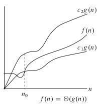
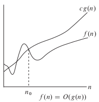
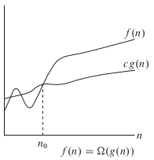

# Big O

## Big Theta

$\Theta(g(n)) = \{f(n):$ there exists positive constants $c_1, c_2, n_0$ s.t.
$$0 \leq c_1g(n) \leq f(n) \leq c_2g(n), \forall n \geq n_0$$
$\}$

---

## Big O

$\mathbb{O}(g(n)) = \{f(n):$ there exists positive constants $c, n_0$ s.t.
$$0 \leq f(n) \leq cg(n), \forall n \geq n_0$$
$\}$

---

## Big Omega

$\Omega(g(n)) = \{f(n):$ there exists positive constants $c, n_0$ s.t.
$$0 \leq cg(n) \leq f(n), \forall n \geq n_0$$
$\}$

---

## Properties of Theta

1. if $c>0 \in \mathbb{R}$ and $f(n) \in \Theta(g(n))$
   
   $\rightarrow c f(n) \in \Theta(g(n))$

2. if $f_1(n) \in \Theta(g_1(n)), f_2(n) \in \Theta(g_2(n))$
   
   $\rightarrow f_1(n)f_2(n) \in \Theta(g_1(n)g_2(n))$

3. if $f_1(n) \in \Theta(g(n))$ and $f_2(n) \in \mathbb{O}(g(n))$

   $\rightarrow f_1(n) + f_2(n) \in \Theta(g(n))$