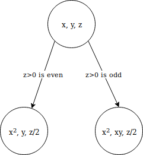

# Invariants

## Floyd's Invariant Principle

### Preserved Invariant

Statement $P($state$)$ about states of a machine.

When $P($q$)$ is true and $q->r$ for some state $r$, **$P(r)$ is also true**.

### Invariant Principle

If $P$ is a preserved invariant & $P($start state$)$ is true, then $P(r)$ **holds for all reachable states** $r$ - including the final state.

---

## Loop Invariants

Used to show that an algorithm with a loop is correct; transitions of state machine are iterations of the loop.

### Method:

Find a **suitable invariant**, then prove:

1. **Initilization:**
   
   The invariant is true prior to the first iteration of the loop.
2. **Maintainence:**

   If the invariant is true prior to the first iteration, it remains true prior to the next iteration.
3. **Termination:**

   The loop terminates, and when it does the invariant gives a useful property which can be used to show the algorithm is correct.

### Fast Exponentiation

    fst_exp(a: float, b: int):
        x = 0
        y = 1
        z = b
        while z > 0:
            r = z mod 2
            z = [z / 2]
            if r == 1:
                y = x * y
            x = x * x
        return y

#### Correctness

Show that $P(x, y, z)$, $z$ is an integer $\geq 0$ & $yx^z = a^b$:

> Assume $P(x, y, z)$ is true and suppose $(x, y, z) \rightarrow (X, Y, Z)$.
> 
> Since $z$ is an integer $\geq 0$, so is $Z = [z/2]$.
> 
> Case $Z$ even:
> 
> * $YX^Z = y(x^2)^{\frac{z}{2}} = yx^z = a^b$ by assumption
> 
> Case $Z$ odd:
> 
> * $YX^Z = xy(x^2)^{\frac{z-1}{2}} = yx^z = a^b$ by assumption
> 
> $\therefore$ in either case $P(X, Y, Z)$ is true.

**Initilization:**

* $P($start state$)$ holds, as $b$ is an integer $\geq 0$ and $1 \times a^b = a^b$

**Maintainence:**

* $P$ is a preserved invariant, so by the *Invariant Principle* $P$ is true for all reachable states

**Termination:**

* If the state $(x, y, 0)$ is reachable, the program terminates and returns $y=yx^0=a^b$ as required
* It is reachable as $z$ starts equal to $b$, and gets halved with each transition - it reaches 0 after at most $log{b} + 1$ transitions

### Insertion Sort

    ins_sort(l):
    for j in range(1, len(l)):
        key = l[j]
        i = j - 1
        while i > 0 and l[i] > key:
            l[i + 1] = l[j]
            i = i - 1
        l[i + 1] = key

**Loop Invariant**:

* at the start of an iteration of the for loop, $l[1, ..., j-1]$ have elements originally in $l[1, ..., j-1]$ but sorted.

**Initilization:**:

* before the first loop iteration, $j=2$; $l[1, ..., j-1]$ has just one element and is trivially sorted.

**Maintenance:**

* the for loop moves $l[j-1], l[j-2], ...$ one place to the right until it finds the right position for $l[j]$ and inserts it, making $l[1...j]$ sorted
* incrementing $j$ for the next iteration preserves invariant

**Termination:**

* the for loop terminates when $j=len(l) + 1$
* since the invariant is preserved, on termination $l[1...len(l)]$ has the same elements as input array $l$, but in sorted order